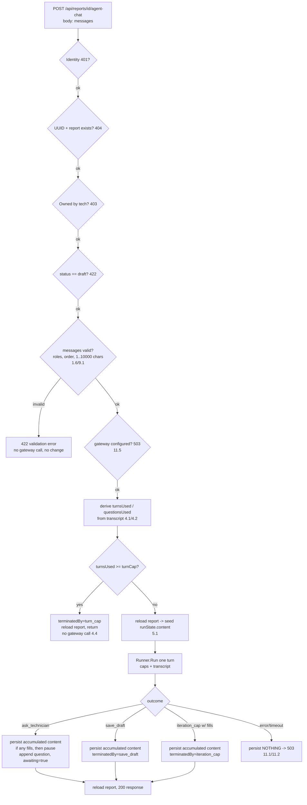
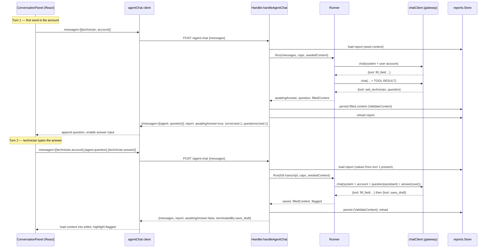

# Design Document: Agent Conversation
# Design Document: Agent Conversation

## Overview

Agent Conversation turns Report Mate's shipped one-shot agent into a multi-turn
collaboration. Today, `POST /api/reports/{id}/agent-fill` runs the hand-rolled
JSON tool-calling loop once against a technician's free-text account and either
fills what it can and `save_draft`s, or flags and stops. This feature lets the
agent instead **ask the technician a clarifying question**, pause, and resume on
the next request with the answer — so drafting becomes a short back-and-forth.

The design is an **additive evolution** of `backend/internal/agent`, not a
rewrite. The existing pieces are reused verbatim where possible:

- The `chatClient` seam, `gatewayClient`, and `chatMessage` transcript shape
  (`client.go`) are unchanged — including the load-bearing quirk that tool
  results are fed back as `role:"user"` `"TOOL RESULT: "+json`, because the
  Bedrock gateway rejects `role:"tool"`.
- The `toolRegistry`, `fill_field`, the four context/flag tools, and their
  `reports.validateValue`-mirroring accept rules (`tools.go`) are unchanged. The
  new `ask_technician` tool is **intercepted by the runner** exactly like
  `save_draft` — it is not a registry handler.
- The `RunLog` (`runlog.go`), `filledByAfterAgent` / `newPersistFunc`
  persistence seam, and the validation-first HTTP guard ladder (`handler.go`)
  are reused. `newPersistFunc` gains a small generalization so a turn can
  persist at its end without a `save_draft`.
- `reports.ValidateContent` stays the single write boundary; `filled_by`
  transitions per the existing rule; `status` is never touched.

Three locked decisions shape everything below:

1. **Client-carried conversation state.** The frontend holds the running
   transcript and re-sends it every turn. **No new database table, no
   migration.** The backend endpoint is stateless per request.
2. **The one-shot path is the degenerate single-turn case.** The first turn is
   the same free-text account; an account the agent can fully draft ends in one
   turn with the same outcome `agent-fill` produces today.
3. **Scoped-but-free-text chat.** The technician types freely; the system prompt
   keeps the agent focused on filling *this* report's template.

**Endpoint decision (stated):** add a **new** endpoint
`POST /api/reports/{id}/agent-chat` that runs one turn from a client-supplied
transcript. **Leave `POST /api/reports/{id}/agent-fill` in place, untouched** —
it still works and is exactly the single-turn case. The new chat UI uses
`agent-chat`; `agent-fill` is not called by the new UI but is not removed, so
nothing that already depends on it breaks. This keeps the change strictly
additive and the risk low.

## Architecture

The agent package keeps its shape: an HTTP `Handler`, a `Runner` that owns one
turn's tool-calling loop, a `chatClient` to the gateway, a `toolRegistry`, and
the `RunLog`. The new work is threaded through, not bolted beside:

- A new handler method `handleAgentChat` runs the same validation-first guard
  ladder as `handleAgentFill`, then validates the transcript, derives the caps
  from the transcript, runs **one** turn, persists at turn end when the turn
  filled anything, and returns the grown transcript.
- `Runner.Run` is generalized to accept the whole prior transcript
  (`RunInput.Messages`) instead of only a single `Account`, and to intercept
  `ask_technician` as a pause.
- Persistence moves from "only on `save_draft`" to "once at turn end whenever
  the turn filled anything" — still through `newPersistFunc` /
  `reports.ValidateContent`, still atomic (all-or-nothing per turn).

### Per-turn request lifecycle



### Pause / resume sequence across two turns



### Message assembly for a resumed turn

At the start of every turn the runner rebuilds the gateway transcript
deterministically from the conversation messages the client sent, so the model
sees its own prior questions and the technician's answers. Combined with seeding
`runState.content` from the **currently persisted** report (reloaded this
request), the model also implicitly has what it already filled (via the schema +
the values already in the draft, and it may call `get_template_schema`).

Assembly, in order:

1. `{role:"system", content: buildSystemPrompt(schema, caps)}` — the system
   prompt now also states the remaining question budget for this turn.
2. For each `ConversationMessage` in transcript order:
   - `technician` → `{role:"user", content: message.content}`
   - `agent` → `{role:"assistant", content: message.content}`
3. The loop then appends, within this turn only, the assistant tool-call replies
   and `"TOOL RESULT: "+json` user messages exactly as today.

So a resumed turn's initial transcript is, e.g.:

```
system:    <prompt + "you have 3 questions left this turn">
user:      "Swapped the compressor, took about 2 hours."   (account)
assistant: "Which model compressor did you install?"        (prior question)
user:      "A Copeland ZR72."                                (the answer)
```

The technician's first message is always the account; there is no separate
`account` field.

## Components and Interfaces

### Config — conversation caps (`internal/config/config.go`)

Two optional settings resolve to positive-integer caps, applying defaults when
absent, zero, negative, or non-numeric (Req 4.3):

```go
const (
    defaultTurnCap     = 6 // Req 4.1
    defaultQuestionCap = 4 // Req 4.2
)

// Config gains:
//   ConversationTurnCap     int // env AGENT_CONVERSATION_TURN_CAP
//   ConversationQuestionCap int // env AGENT_CONVERSATION_QUESTION_CAP

// resolveCap parses a raw env value, returning def when it is absent or not a
// positive integer (Req 4.3).
func resolveCap(raw string, def int) int {
    n, err := strconv.Atoi(strings.TrimSpace(raw))
    if err != nil || n <= 0 {
        return def
    }
    return n
}
```

`cmd/server` passes these to the agent handler alongside the existing gateway
settings. The runner receives them per request through `RunInput` (below).

### New endpoint handler (`internal/agent/handler.go`)

`RegisterRoutes` adds one line; the existing `agent-fill` route is untouched:

```go
mux.HandleFunc("POST /api/reports/{id}/agent-fill", h.handleAgentFill) // unchanged
mux.HandleFunc("POST /api/reports/{id}/agent-chat", h.handleAgentChat) // new
```

`handleAgentChat` reuses `handleAgentFill`'s guard ladder verbatim (identity →
UUID/existence → ownership → status → gateway-configured), then:

1. Decode `{ messages: []ConversationMessage }`; `DisallowUnknownFields`.
2. Validate the transcript (see Transcript validation): non-empty, alternating-
   role-sane, roles in `{technician, agent}`, each `content` 1..10000 chars
   after trim, and the **last** message must be a `technician` message (the
   account or an answer) — a turn only runs when it is the technician's move
   (Req 3.3). Any failure → 422, **no gateway call, no draft change** (Req 1.6).
3. Derive `turnsUsed` and `questionsUsed` from the transcript (see below). If
   `turnsUsed >= turnCap`, return the cap-reached response **without any gateway
   call** (Req 4.4) — reload the report and report `terminatedBy:"turn_cap"`.
4. Reload the report to seed `runState.content` with the currently persisted
   values (Req 5.1), then run one turn.
5. Map the result to the response (see Persistence per turn and Error handling).

The Handler struct gains the two cap ints; `NewHandler` / `NewHandlerFromConfig`
gain two `int` params. The `chatClient == nil` branch is shared (Req 11.5).

### Transcript-derived cap enforcement

The caps bound the **conversation**, but the backend is stateless per turn, so
they are computed from the transcript the client sends — the client cannot
bypass a cap by "not counting":

```go
// questionsUsed counts prior Agent_Questions already in the transcript: the
// number of agent-role messages (each ended a turn with a question).
func questionsUsed(messages []ConversationMessage) int {
    n := 0
    for _, m := range messages {
        if m.Role == "agent" {
            n++
        }
    }
    return n
}

// turnsUsed counts completed turns from the transcript. A turn either ended by
// asking (an agent message) or terminally (save/cap/error, which ends the
// conversation and produces no further request). The turn ABOUT to run is not
// counted; it is bounded by turnsUsed >= turnCap enforced BEFORE running.
// turnsUsed = number of agent messages + (the current run counts as one when
// it proceeds). We enforce: reject when questionsUsed already at the cap forces
// no-ask, and terminate when the agent-message count implies the turn cap.
func turnsUsed(messages []ConversationMessage) int {
    return questionsUsed(messages) // one agent message == one completed turn that paused
}
```

Enforcement per request:

- **Turn cap (Req 4.1, 4.4):** if `turnsUsed(messages) >= turnCap`, do not run;
  return `terminatedBy:"turn_cap"` with the reloaded (unchanged) report. A
  conversation that keeps pausing therefore always terminates after `turnCap`
  agent questions' worth of turns.
- **Question cap (Req 4.2, 4.5):** compute `questionsRemaining = questionCap -
  questionsUsed(messages)`. Pass it into the turn. When `questionsRemaining <=
  0`, the system prompt for that turn instructs the model to stop asking and
  flag/save instead, **and** the runner rejects any `ask_technician` that turn
  (forcing flag/save), so the cap cannot be exceeded even if the model ignores
  the instruction.

Both counts are derived server-side every request from the transcript, so the
guarantee holds regardless of what the client claims. `turnsUsed`/`questionsUsed`
are also echoed in the response for the UI, but the server never trusts a
client-supplied count.

### Runner generalization (`internal/agent/runner.go`)

`RunInput` drops the single `Account` in favor of the full transcript plus the
per-turn caps:

```go
type RunInput struct {
    ReportID string
    Schema   templates.TemplateSchema
    Content  reports.ReportContent // COPY of CURRENT persisted content (reloaded this turn)
    JobID    *string
    Messages []ConversationMessage // full prior transcript; last is the technician's move
    Jobs     JobHistoryProvider
    Parts    PartsCatalogProvider

    QuestionsRemaining int // questionCap - questionsUsed; <=0 forbids ask_technician this turn
}
```

`RunResult` gains the pause fields:

```go
type RunResult struct {
    Content         reports.ReportContent
    FlaggedFieldIDs []string
    TotalTokens     int
    TerminatedBy    string // + "ask_technician"
    Saved           bool   // true when content was persisted this turn (save_draft OR filled-then-pause)
    AwaitingAnswer  bool   // true when TerminatedBy == "ask_technician"
    Question        string // the validated question, when AwaitingAnswer
    Filled          bool   // true when any fill_field succeeded this turn (drives persist-at-end)
    Log             *RunLog
}
```

`Run` changes in three focused ways; the loop body is otherwise the existing
code:

1. **Transcript seeding.** Instead of `[system, user(account)]`, build the
   initial `[]chatMessage` from `buildSystemPrompt(schema, in.QuestionsRemaining)`
   followed by each `ConversationMessage` mapped to `user`/`assistant` (see
   Message assembly). `runState.content` is `copyContent(in.Content)` where
   `in.Content` is the just-reloaded persisted content (Req 5.1, 5.5).
2. **`ask_technician` interception.** Between the `save_draft` interception and
   the registry dispatch, intercept `call.Tool == "ask_technician"`:
   - Validate the question: trim; reject empty/whitespace or `len > 500`
     (Req 2.5). Also reject when `in.QuestionsRemaining <= 0` (Req 4.5). A
     rejected question is **logged** and the loop **continues** — it does not
     pause (Req 2.5) — by feeding a `TOOL RESULT` back like any rejection.
   - A valid question **pauses**: set `result.TerminatedBy="ask_technician"`,
     `AwaitingAnswer=true`, `Question=trimmed`, `Filled` per whether any fill
     happened, `result.Content = *st.content`, collect flagged ids, log
     `Terminate("ask_technician")`, and **return** — the turn does **not** emit
     `save_draft` (Req 2.2) and does not loop further.
3. **`Filled` tracking.** `fillFieldHandler` already returns `Ok:true` on a
   successful write; the runner sets `result.Filled = true` whenever a
   dispatched `fill_field` returns `Ok:true`, so the handler knows a paused or
   cap-terminated turn still has content worth persisting.

`save_draft` interception is unchanged except it now persists via the same
turn-end path (below). The iteration-cap and gateway-error/timeout arms are
unchanged in control flow; what differs is who persists (the handler, at turn
end) — see next.

### `ask_technician` tool contract (system prompt)

`buildSystemPrompt(schema, questionsRemaining)` adds `ask_technician` to the
tool list and states the budget:

```
- {"tool":"ask_technician","question":"..."}
    Ask the technician ONE short question (<=500 chars) for information you need
    to fill a field and cannot get from the account, job history, or parts
    catalog. Emitting this pauses the draft and waits for their answer. Prefer
    asking over flagging a required field. Frame every question as a request for
    information to fill or flag a specific template field.
```

When `questionsRemaining <= 0`, the prompt instead says:

```
You have used all your questions for this report. Do NOT call ask_technician.
Flag any required field you still cannot fill with flag_missing_field, then
emit save_draft.
```

The `save_draft` and `fill_field` descriptions are unchanged. Req 9.3/9.4
scoping language (fill only template fields; never create a report or template)
is the existing prompt text, kept.

### Persistence per turn (`internal/agent/handler.go`)

The cross-turn persistence rule (Req 5), stated precisely:

- Fields fill **in-memory** during a turn (`fillFieldHandler` mutates the
  runner's copy).
- The turn persists **exactly once, at its end, through
  `reports.ValidateContent`**, in these terminal cases:
  - `save_draft` — the explicit "I'm done" terminator (persist, `Saved=true`).
  - `ask_technician` **when the turn filled anything** (`Filled == true`) —
    persist the accumulated content so nothing is lost between turns, then pause.
  - `iteration_cap` **when the turn filled anything** — persist, then terminate.
- The turn persists **nothing** on:
  - gateway error / timeout (Req 5.4, 11.1, 11.2),
  - `parse_failure`,
  - any terminal case where `Filled == false` (nothing to save),
  - a `ValidateContent` failure (the write is rejected atomically; prior
    persisted content is unchanged — Req 5.2).

This keeps each turn **atomic**: at most one validated write, all-or-nothing.
Because the next turn reloads the report to seed `runState.content`, values
persisted at the end of an earlier turn are present again (Req 5.1). A
technician value edited directly (persisted between turns via the manual save
path) is the baseline the runner seeds from and is not overwritten unless the
model fills that field this turn (Req 5.5).

Mechanically, the handler decides who persists based on the result:

```go
// The runner returns the accumulated content and whether the turn filled
// anything. The HANDLER performs the single turn-end persist for pause/cap
// outcomes; the runner still performs the save_draft persist inline (unchanged)
// so save_draft error mapping is preserved.
persist := newPersistFunc(store, rec.ID, rec.SchemaSnapshot, rec.Content.FilledBy, rec.CustomerName)

res, runErr := runner.Run(ctx, in, persist)

// runErr handling (gateway/timeout -> 503, ValidationError -> 422) is the
// existing agent-fill logic, reused.
if runErr == nil && !res.Saved && res.Filled &&
    (res.TerminatedBy == "ask_technician" || res.TerminatedBy == "iteration_cap") {
    if err := persist(ctx, res.Content); err != nil {
        // ValidateContent rejection -> 422, prior content intact (Req 5.2).
        var verr *reports.ValidationError
        if errors.As(runErr, &verr) { /* 422 with element */ }
        // otherwise 503
        return
    }
}
```

`newPersistFunc` is reused unchanged: it applies `filledByAfterAgent`
(Req 5.3), runs `ValidateContent(schema, content, false)`, and writes with an
empty `Title` (leaving title untouched) and `status` never written (Req 8.1).
To avoid a double-persist, the runner performs the `save_draft` persist inline
(as today) and the handler performs the pause/cap persist; `Saved` distinguishes
which happened.

### Frontend chat client (`frontend/src/api/agent.ts`)

`agentFill` and its types stay. Add the chat client alongside, through the same
`request` helper — no direct fetch, no gateway URL/key (Req 10.4):

```ts
export type ConversationRole = "technician" | "agent";
export interface ConversationMessage { role: ConversationRole; content: string; }

export interface AgentChatInput { messages: ConversationMessage[]; }

export interface AgentChatResponse {
  messages: ConversationMessage[];      // grown transcript incl. new agent message
  report: ReportRecord;                 // reloaded draft
  flaggedFieldIds: string[];
  awaitingAnswer: boolean;
  terminatedBy: string;                 // save_draft | turn_cap | iteration_cap | ask_technician | parse_failure
  tokenUsage: number;
  turnsUsed: number;
  questionsUsed: number;
}

export function agentChat(id: string, input: AgentChatInput): Promise<AgentChatResponse> {
  return request<AgentChatResponse>(
    "POST",
    `/api/reports/${encodeURIComponent(id)}/agent-chat`,
    input,
  );
}
```

The `ApiError.status === 503` (unavailable) and `ApiValidationError` (422)
contracts are the existing ones from `client.ts`, reused.

### Frontend chat panel (`ReportEditor/ConversationPanel.tsx`)

**Decision:** replace `AgentAssistPanel`'s single-shot textarea with a chat
thread in a new `ConversationPanel`, mounted in the same `report`-mode slot in
`ReportEditorPage`. The old panel can be kept in the tree but the editor renders
`ConversationPanel`. Graceful behavior is preserved: on 503 the panel shows the
unavailable message and the manual fill path is untouched (Req 11.3, 11.4).

State held in React (the client-carried `Conversation_State`):

- `messages: ConversationMessage[]` — the transcript.
- `input: string` — the current textarea; first send is the account, later
  sends are answers.
- `phase: "idle" | "sending" | "awaiting" | "done" | "error"`.
- Derived from the last response: `turnsUsed`, `questionsUsed`, `awaitingAnswer`.

Behavior:

- Render a scrollable message list: technician messages right/aligned, agent
  messages left, high-contrast, big tap targets (mobile-first, matches product
  design principles).
- On send: append `{role:"technician", content: input}` locally, call
  `agentChat(reportId, {messages})`, then replace `messages` with
  `response.messages` (server-authoritative transcript). While in flight, the
  send button is disabled and shows "Working…".
- When `response.awaitingAnswer`: show the agent's question (already the last
  message) and keep the input enabled for the answer.
- When the run completes (`awaitingAnswer === false`): call the existing
  `onFilled`-style callback so `ReportEditorPage` loads `response.report`
  content via `contentFromWire` and highlights `response.flaggedFieldIds` —
  identical to today's agent-fill handling (`handleAgentFilled`). Set
  `phase="done"`.
- Show usage subtly: `Questions {questionsUsed}/{questionCap}` /
  `Turns {turnsUsed}/{turnCap}` (the caps are shipped as constants mirroring the
  backend defaults; a small config echo could be added later).
- Disable send while a turn is in flight, or when `turnsUsed >= turnCap`
  (cap reached — show "conversation limit reached, finish by hand").
- 503 → show the unavailable copy, leave the transcript and form untouched
  (Req 11.3).

`ReportEditorPage` integration is unchanged in spirit: the completed-run handler
is the current `handleAgentFilled` (loads content, sets `flaggedIds`, clears
highlight/status). `canSave`, the highlight set, and the report-mode gating all
stay. The manual Save draft / Save and Export flow is fully independent
(Req 8.3, 11.4).

## Data Models

No new database tables and no migration (locked decision 1). All new types are
wire/in-memory only.

### Wire types (backend `agent`, frontend `api/agent.ts`)

```go
// ConversationMessage is one transcript entry. role is "technician" | "agent";
// content is 1..10000 chars (validated). The technician's first message is the
// account; a later technician message is an answer to an Agent_Question.
type ConversationMessage struct {
    Role    string `json:"role"`
    Content string `json:"content"`
}

// agentChatRequest is the POST /api/reports/{id}/agent-chat body.
type agentChatRequest struct {
    Messages []ConversationMessage `json:"messages"`
}

// agentChatResponse NEVER carries the gateway key (Req 10.2).
type agentChatResponse struct {
    Messages        []ConversationMessage `json:"messages"`
    Report          reports.ReportRecord  `json:"report"`
    FlaggedFieldIDs []string              `json:"flaggedFieldIds"`
    AwaitingAnswer  bool                  `json:"awaitingAnswer"`
    TerminatedBy    string                `json:"terminatedBy"`
    TokenUsage      int                   `json:"tokenUsage"`
    TurnsUsed       int                   `json:"turnsUsed"`
    QuestionsUsed   int                   `json:"questionsUsed"`
}
```

### In-memory run types

`toolCall` gains a `Question` field for the `ask_technician` shape:

```go
type toolCall struct {
    Tool     string          `json:"tool"`
    FieldID  string          `json:"field_id,omitempty"`
    Value    json.RawMessage `json:"value,omitempty"`
    JobID    string          `json:"job_id,omitempty"`
    Question string          `json:"question,omitempty"` // ask_technician
}
```

`RunInput` / `RunResult` evolve as shown in Runner generalization. `runState`
is unchanged — `ask_technician` is intercepted by the runner and never touches
`runState` beyond logging, so no new state field is needed. The persisted
`Report_Draft` (`service_reports`) shape is unchanged: `content` (values +
parts), `filled_by`, `status`.

### Transcript validation rules

- `messages` non-empty; each `role` in `{technician, agent}`.
- Each `content`: `1 <= len(strings.TrimSpace(content)) <= 10000` (Req 1.6,
  9.1).
- Roles must be sane for a resumable exchange: the sequence, ignoring content,
  must be technician-first and every `agent` message must be preceded by a
  `technician` message; the **last** message must be `technician` (the move that
  triggers this turn — Req 1.4, 3.3).
- A violation → 422 identifying the invalid input, **no gateway call, no draft
  change** (Req 1.6).

## Correctness Properties

*A property is a characteristic or behavior that should hold true across all
valid executions of a system — essentially, a formal statement about what the
system should do. Properties serve as the bridge between human-readable
specifications and machine-verifiable correctness guarantees.*

All runner properties are tested with a **scripted mock `chatClient`** — never
the live gateway.

### Property 1: Transcript growth

*For any* valid input transcript and any turn outcome, the transcript returned
by a turn contains the input transcript as a prefix and appends only agent-role
messages produced during that turn (at most one, the question, on a pause; none
otherwise).

**Validates: Requirements 1.3, 2.4**

### Property 2: Message assembly preserves order and role mapping

*For any* valid transcript, the gateway messages the runner assembles are the
system prompt followed by each conversation message in order, with `technician`
mapped to `role:"user"` and `agent` mapped to `role:"assistant"`, so a resumed
turn carries the full prior context including the agent's earlier question and
the technician's answer.

**Validates: Requirements 1.4, 3.1**

### Property 3: One-shot equivalence

*For any* account and scripted model action sequence that fills fields and
`save_draft`s without asking a question, a single-turn `agent-chat` run persists
the same report content as the one-shot `agent-fill` run for the same input.

**Validates: Requirements 1.5**

### Property 4: Message validation rejects invalid input with no side effects

*For any* message that is empty, whitespace-only, or exceeds 10,000 characters,
the endpoint rejects the request with a validation error, makes zero gateway
calls, and leaves the persisted draft content, `filled_by`, and `status`
unchanged.

**Validates: Requirements 1.6, 9.1**

### Property 5: ask_technician always pauses and never co-occurs with save_draft

*For any* turn in which the model emits a valid `ask_technician` call, the turn
terminates immediately with `AwaitingAnswer == true` and `Question` equal to the
trimmed question text, appends exactly that one agent message to the transcript,
and emits no `save_draft` in that turn.

**Validates: Requirements 2.2, 2.3, 2.4**

### Property 6: Invalid question is rejected and the loop continues

*For any* `ask_technician` question that is empty, whitespace-only, or exceeds
500 characters, the turn does not pause, records the rejection in the Run_Log,
and continues the loop to the model's next action.

**Validates: Requirements 2.5**

### Property 7: Turn cap derived from the transcript always terminates

*For any* transcript whose derived `turnsUsed` is at least the configured turn
cap, the endpoint terminates the conversation with a cap-reached result, makes
zero gateway calls, and returns the reloaded draft unchanged.

**Validates: Requirements 4.1, 4.4**

### Property 8: Question cap forbids further questions

*For any* transcript whose derived `questionsUsed` is at least the configured
question cap, any `ask_technician` call in that turn is rejected and the loop
continues (the turn never pauses on a question).

**Validates: Requirements 4.2, 4.5**

### Property 9: Cap resolver applies defaults for invalid config

*For any* configuration value that is absent, zero, negative, or non-numeric,
the resolved cap equals its default (6 turns, 4 questions).

**Validates: Requirements 4.3**

### Property 10: Per-turn iteration cap terminates the turn

*For any* scripted model that never emits `ask_technician` or `save_draft`, the
turn terminates by the iteration cap within 10 loop iterations.

**Validates: Requirements 4.6**

### Property 11: Prior-turn values survive a reload seed

*For any* draft content persisted at the end of one turn, a subsequent turn that
seeds `runState.content` from the reloaded persisted content begins with those
values present, and a turn that does not fill a given field leaves that field's
prior value unchanged after persisting.

**Validates: Requirements 5.1, 5.5**

### Property 12: Persist goes through the Content_Validator

*For any* turn that persists, every field id in the persisted content is
declared by the template schema; and *for any* proposed content containing a
value that violates the schema, the persist is rejected and the previously
persisted content remains exactly as it was.

**Validates: Requirements 5.2, 5.6**

### Property 13: filled_by transition

*For any* prior `filled_by`, an agent persist sets `filled_by` to `agent` when
the prior was empty or `agent`, and to `mixed` when the prior was `manual` or
`mixed`.

**Validates: Requirements 5.3**

### Property 14: A failed turn persists nothing

*For any* turn that terminates by gateway error, timeout, parse failure, or the
per-turn iteration cap, the persisted draft `content`, `filled_by`, and `status`
equal their values from before that turn began.

**Validates: Requirements 5.4, 11.1**

### Property 15: Valid fills land in content in the validator-accepted shape

*For any* `fill_field` call targeting a declared text, number, select, or
checklist field with a value the Content_Validator accepts, the value is written
into the draft content in the exact wire shape `reports.validateValue` accepts
(text/select as a string, number as a numeric string, checklist as an array of
option strings).

**Validates: Requirements 6.1, 6.4**

### Property 16: fill_field rejects unwritable targets and values

*For any* `fill_field` call whose target field id is not in the schema, whose
target is a photo or signature field, whose number value cannot be interpreted
as a number, or whose select/checklist value is not among the field's options,
the write is rejected, the content is left unchanged, and the rejection is
recorded in the Run_Log with the offending field id (and value where relevant).

**Validates: Requirements 6.2, 6.3, 6.5, 6.6**

### Property 17: Flagged set is returned and flagged fields stay unfilled

*For any* sequence of `flag_missing_field` calls in a run, the returned flagged
field id set equals the set of unique valid field ids flagged, and no flagged-
only field carries a value in the persisted content.

**Validates: Requirements 7.2, 7.3**

### Property 18: Status invariant

*For any* conversation turn and any terminal outcome, the persisted report
`status` remains `draft`; no turn sets it to `submitted` or `exported`.

**Validates: Requirements 8.1, 8.2, 8.4**

### Property 19: The gateway key never leaks

*For any* turn, the serialized HTTP response body and the serialized Run_Log
contain no occurrence of the configured gateway key.

**Validates: Requirements 10.2, 10.3**

### Property 20: Run log mirrors dispatch and sums token usage

*For any* sequence of dispatched tool calls and gateway responses in a turn, the
Run_Log's ordered entries match that dispatch sequence (tool name, arguments,
result) and the recorded total token usage equals the sum of the `total_tokens`
reported by the gateway responses.

**Validates: Requirements 10.5, 10.6**

## Error Handling

The per-turn failure map reuses the existing `httpx` envelopes and the
`agent-fill` mapping. `handleAgentChat` shares the guard ladder, so the guard
responses are identical:

| Condition | Status | Body | Draft |
| --- | --- | --- | --- |
| Unauthenticated | 401 | `unauthenticated` | untouched |
| Malformed / unknown report id | 404 | `not_found` | untouched |
| Technician not owner | 403 | `authorization_error` | untouched |
| Report not `draft` (Req 1.8) | 422 | `validation_error` "report is not editable" | untouched |
| Invalid transcript / message (Req 1.6, 9.1) | 422 | `validation_error` naming the input | untouched, **no gateway call** |
| Gateway unconfigured (Req 11.5) | 503 | `agent_unavailable` | untouched, **no gateway call** |
| Turn cap already reached (Req 4.4) | 200 | `terminatedBy:"turn_cap"`, reloaded report, `awaitingAnswer:false` | unchanged, **no gateway call** |
| Gateway unreachable / non-2xx (Req 11.1) | 503 | `agent_unavailable` | unchanged (nothing persisted) |
| Per-turn timeout 60s (Req 11.2) | 503 | `agent_unavailable` (timed out) | unchanged |
| Persist `ValidateContent` failure (Req 5.2) | 422 | `validation_error` with offending element | prior content intact |
| `ask_technician` valid (Req 2.3) | 200 | grown transcript, `awaitingAnswer:true`, question is last message | persisted iff turn filled anything |
| `save_draft` (Req 5) | 200 | grown transcript, `awaitingAnswer:false`, `terminatedBy:"save_draft"` | persisted |
| `parse_failure` / `iteration_cap` no fills | 200 | reloaded (unchanged) report, `awaitingAnswer:false` | unchanged |
| `iteration_cap` with fills | 200 | reloaded report with persisted content | persisted |

`awaitingAnswer` semantics: `true` only when the turn paused on a valid
`ask_technician`; the frontend then keeps the input enabled for the answer and
runs the next turn on the next send. `false` on every terminal outcome; the
frontend loads the returned content into the editor and highlights flagged ids.

Every failure path leaves the draft editable by hand with `status` `draft`
(Req 11.3); the manual fill path never calls the agent endpoint (Req 11.4).

## Testing Strategy

Property-based testing applies here: the runner turn logic, message assembly,
cap derivation, and `fill_field`/persist rules are pure or mock-isolatable
functions with clear input/output behavior over large input spaces. The HTTP
endpoint, timeouts, and the React thread are covered by example/integration/
component tests.

### Property tests (Go, minimum 100 iterations, mock `chatClient` only)

Use `testing/quick` or `pgregory.net/rapid` (recommended for shrinking) — do not
hand-roll a generator harness. Each property test is tagged
`// Feature: agent-conversation, Property {n}: {property text}` and references
its design property. All 20 properties above map to a single property-based test
each. Key generators:

- Random valid transcripts (technician-first, alternating-sane, last message
  technician, in-range content) — Properties 1, 2, 4, 7, 8.
- Random scripted `chatClient` action sequences (fill/flag/ask/save, valid and
  invalid questions, benign no-terminate loops) — Properties 3, 5, 6, 10, 14,
  17, 20.
- Random `(field, value)` pairs over the six field types incl. out-of-option and
  non-numeric values, against a generated schema — Properties 15, 16.
- Random persisted-content seeds and prior `filled_by` values — Properties 11,
  12, 13, 18.
- A sentinel gateway key checked against response/log serialization — Property
  19.
- Random cap env strings (absent, "0", "-3", "abc", "5") — Property 9.

A fake `reports.Store` (or the runner's `persistFunc` seam) records writes so
atomicity (Properties 12, 14, 18) is asserted without a database.

### Unit / example tests (Go)

- Guard-ladder examples: 401/404/403/422 for each guard, asserting **zero mock
  gateway calls** (Req 1.7, 1.8, 11.5).
- `ask_technician` with a valid question captured once (Req 2.1 mechanic).
- Prompt smoke: the system prompt contains the `ask_technician` scoping text and,
  when `questionsRemaining <= 0`, the "do not ask" instruction (Req 2.6, 4.5,
  9.3); the registry exposes only the allowed tools and no create-report/
  template tool (Req 9.4).
- Config-only key example (Req 10.1).

### Integration tests (Go, `httptest`, mock `chatClient`)

- Full pause/resume across two requests: turn 1 asks (persists the partial
  fill), turn 2 resumes from the returned transcript and saves; assert values
  from turn 1 survive into turn 2 (Req 5.1) and the final draft is complete.
- Timeout: a blocking mock with a short overall budget → 503, draft unchanged
  (Req 11.2, 4.7 — the per-request 30s cap is the client's `http.Client`
  timeout).
- Gateway error mapping → 503 (Req 11.1).

### Frontend tests (React, mocked `agentChat`)

- Chat thread: first send posts `{messages:[{technician, account}]}`; the
  returned transcript renders in order.
- Awaiting answer: a response with `awaitingAnswer:true` shows the agent
  question and keeps the input enabled; the next send includes the full
  transcript.
- Completion: a response with `awaitingAnswer:false` loads `report` content into
  the editor and highlights `flaggedFieldIds` (via the existing
  `handleAgentFilled`).
- Cap disable: when `turnsUsed >= turnCap`, the send button is disabled with the
  limit message.
- 503 fallback: an `ApiError` status 503 shows the unavailable copy and leaves
  the transcript and form untouched; the manual Save draft / Save and Export
  buttons still work (Req 11.3, 11.4).
