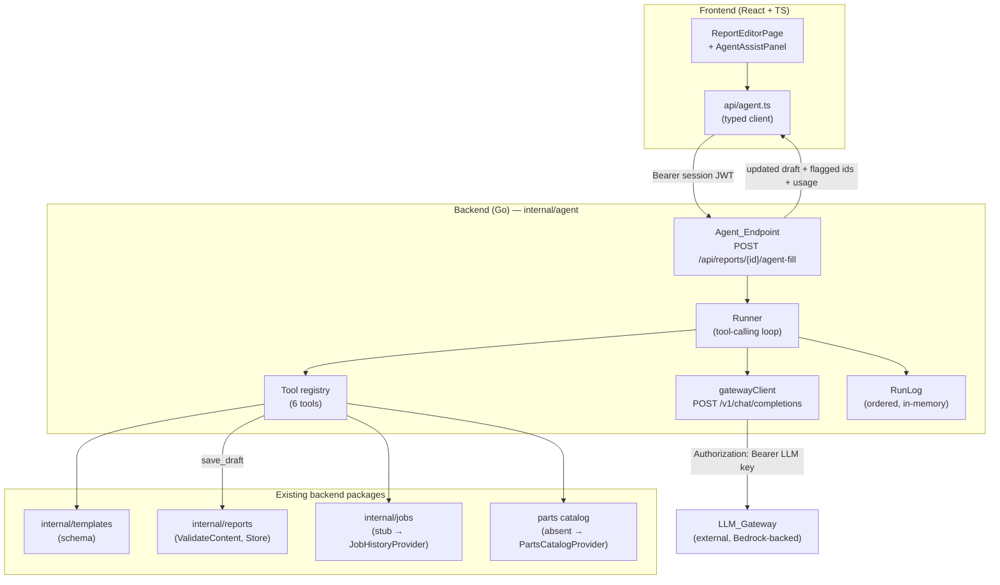
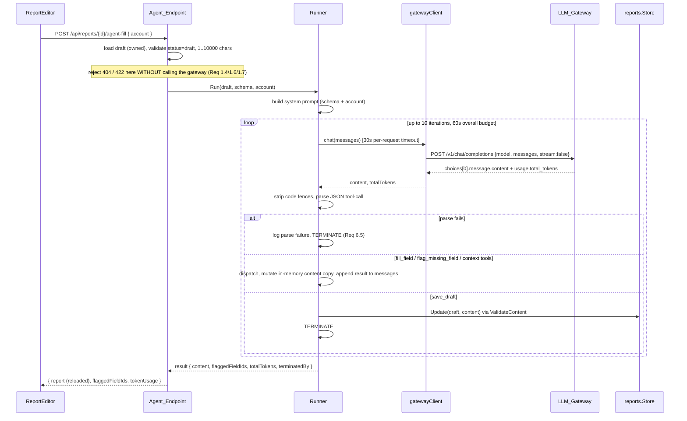

# Design Document: AI Agent

## Overview

The AI agent lets a technician draft a service report from a rough, typed
free-text account instead of filling every field by hand. It reads the chosen
template's schema, pulls in supporting context (job history, parts catalog),
fills the fields it can confidently fill, and flags the required fields it
cannot. The technician always reviews and edits the result in the existing
Report Editor before submitting.

This feature is built as a hand-rolled JSON tool-calling loop in
`backend/internal/agent` — the only package permitted to talk to the LLM
gateway. It does **not** use native tool-calling (documented reliability
problems on the current gateway build) and it does **not** introduce
LangChain/LangGraph or a second runtime. It builds on already-shipped
machinery:

- `internal/templates` — the `TemplateSchema` (sections → typed fields, each
  with `required` and `Options`).
- `internal/reports` — the `ReportContent` model (`Values` keyed by field id,
  `Parts`, `FilledBy`), the `ValidateContent` security boundary (rejects any
  write to a field id not declared by the schema snapshot), and the
  `Store`/`Service` persistence path.
- The Report Editor UI (`frontend/src/pages/ReportEditor`), which already loads
  a `ReportRecord`, narrows its content to a typed value union, renders one
  control per field, and highlights an offending field by id.

Three product principles bound the design:

- **Human-in-the-loop always** — the agent leaves `status` as `draft`; a human
  reviews and submits.
- **Graceful degradation** — a gateway outage leaves the draft untouched; the
  independent manual fill path always works.
- **Predictable over clever** — the agent fills schema-defined fields and flags
  uncertainty; it never improvises outside the template structure.

### Key design decisions

| Decision | Rationale |
| --- | --- |
| Loop lives entirely in `internal/agent`; the frontend calls a Go `Agent_Endpoint` that proxies server-side | The gateway key is tied to the shared credit pool and must never reach the browser (Req 7). |
| Manual JSON tool-calling, not native tool-calling | Verified working against the current gateway (`docs/llm-gateway.md`); native tool-calling has documented reliability problems (Req 6.4). |
| `save_draft` persists through the **existing** `reports` write path and its `ValidateContent` | Reuses the one security boundary that already enforces "only template-defined fields" (Req 2.7); no second validator to drift. |
| The agent mutates an **in-memory copy** of content and persists once, atomically, only on `save_draft` | A failed run must leave persisted content untouched (Req 9.3). |
| `get_job_history` / `get_parts_catalog` sit behind small interfaces returning empty results today | The backing data does not exist yet; the agent must degrade gracefully and the real data must drop in later without touching the agent (Req 5.3, 5.5). |
| The Agent_Endpoint mounts under the existing `/api/reports/{id}` subtree | Reuses the 32 MB body limit and the ownership/identity checks already wrapping report routes. |

### Out of scope (prerequisites flagged, not built here)

- Seeding the `jobs` table / building `internal/jobs` query functions.
- Creating a `parts_catalog` table.

These are the two known dependency gaps. This design consumes them through
interfaces that return empty results until the real data lands; it does not
design the seeding or the catalog table itself.

## Architecture

The frontend never sees the gateway. It calls one new backend route, which runs
the loop server-side and returns the updated draft plus the flagged field ids.



### Request lifecycle



### Placement and wiring

- New package contents live under `backend/internal/agent/`:
  `client.go` (gateway client), `runner.go` (loop), `tools.go` (registry +
  handlers), `prompt.go` (system prompt), `runlog.go` (run log),
  `handler.go` (Agent_Endpoint), `providers.go` (job/parts seams), plus tests.
- The Agent_Endpoint registers under the existing `/api/reports/` subtree so it
  inherits the 32 MB body limit and identity middleware already wired in
  `cmd/server/mountReports`. The agent handler is composed in `cmd/server` and
  its routes are registered on the same `reportsMux` (see Components).

## Components and Interfaces

### 1. Config additions (`internal/config`)

Three fields are added to `config.Config`, read from the environment already
listed in `.env.example`. `LLMGatewayAPIKey` is a secret held here and never
logged (the package already documents this rule for `DatabaseURL` /
`JWTSigningKey`).

```go
// Added to config.Config:
type Config struct {
    // ... existing fields ...

    // LLMGatewayURL is the base URL of the organizer-provided LLM gateway
    // (env LLM_GATEWAY_URL), e.g. https://api.softwaresystems.app. The agent
    // posts to {LLMGatewayURL}/v1/chat/completions.
    LLMGatewayURL string
    // LLMGatewayAPIKey is the bearer key for the gateway (env
    // LLM_GATEWAY_API_KEY). SECRET — never log it, never return it to the
    // client. Tied to the team's shared credit pool.
    LLMGatewayAPIKey string
    // LLMModel is the model alias the agent requests (env LLM_MODEL), e.g.
    // "sonnet4.5". Defaults to defaultLLMModel when unset.
    LLMModel string
}

const defaultLLMModel = "sonnet4.5"
```

Loading behaviour: `LLMGatewayURL` and `LLMGatewayAPIKey` are **optional** at
startup — the server must boot and serve the manual fill path even with no
gateway configured (graceful degradation, Req 9). When either is blank the
agent is considered unconfigured and the Agent_Endpoint answers
`503 agent unavailable` without dialling out. `LLMModel` falls back to
`defaultLLMModel`. No `LLM_*` value is ever included in an error message
(mirrors the existing secret-handling rule).

```go
cfg.LLMGatewayURL    = strings.TrimSpace(os.Getenv("LLM_GATEWAY_URL"))
cfg.LLMGatewayAPIKey = strings.TrimSpace(os.Getenv("LLM_GATEWAY_API_KEY"))
cfg.LLMModel         = valueOr(os.Getenv("LLM_MODEL"), defaultLLMModel)

// AgentConfigured reports whether the gateway URL and key are both present.
func (c Config) AgentConfigured() bool {
    return c.LLMGatewayURL != "" && c.LLMGatewayAPIKey != ""
}
```

### 2. Gateway client (`internal/agent/client.go`)

A small typed HTTP client wrapping the one endpoint the agent uses. It is the
only code that holds the key at request time. Per-request timeout is 30s
(Req 6.7).

```go
// gatewayClient posts chat completions to the organizer gateway. It is the
// only holder of the API key at request time; the key is never logged.
type gatewayClient struct {
    baseURL string
    apiKey  string       // SECRET
    model   string
    http    *http.Client // Timeout: perRequestTimeout (30s)
}

const perRequestTimeout = 30 * time.Second

func newGatewayClient(baseURL, apiKey, model string) *gatewayClient

// chatMessage is one OpenAI-style message.
type chatMessage struct {
    Role    string `json:"role"`    // "system" | "user" | "assistant" | "tool"
    Content string `json:"content"`
}

// chatRequest is the POST /v1/chat/completions body. stream is always false.
type chatRequest struct {
    Model    string        `json:"model"`
    Messages []chatMessage `json:"messages"`
    Stream   bool          `json:"stream"` // always false
}

// chatResponse is the subset of the OpenAI-compatible response the agent reads.
type chatResponse struct {
    Choices []struct {
        Message chatMessage `json:"message"`
    } `json:"choices"`
    Usage struct {
        TotalTokens int `json:"total_tokens"`
    } `json:"usage"`
}

// chatResult is what the loop consumes: the assistant text and the token count.
type chatResult struct {
    Content     string
    TotalTokens int
}

// Chat sends messages and returns the assistant content plus token usage.
// It sets Authorization: Bearer <apiKey> and Content-Type: application/json,
// posts to {baseURL}/v1/chat/completions with stream:false, and reads
// choices[0].message.content and usage.total_tokens. A non-2xx status, a
// transport error, or an empty choices array is returned as an error (never
// carrying the key). The provided ctx also bounds the request; the 30s client
// timeout is the hard per-request cap (Req 6.7).
func (c *gatewayClient) Chat(ctx context.Context, messages []chatMessage) (chatResult, error)
```

Error hygiene: `Chat` wraps failures as a sentinel `errGatewayUnavailable` (for
connectivity/non-2xx) so the endpoint can map it to `503`. The wrapped message
never includes the URL with credentials or the key.

### 3. The tool-calling loop (`internal/agent/runner.go`)

```go
// Runner executes one agent run against one draft. It owns the loop, the
// message accumulation, and the RunLog. It never persists anything except
// through the injected saveDraft closure on a save_draft tool call.
type Runner struct {
    client    chatClient      // interface over gatewayClient (mockable in tests)
    registry  *toolRegistry
    maxIters  int             // 10 (Req 6.6)
    overall   time.Duration   // 60s overall budget (Req 9.2)
}

// chatClient is the seam the runner depends on, so tests inject a mock and
// never fire a live call.
type chatClient interface {
    Chat(ctx context.Context, messages []chatMessage) (chatResult, error)
}

// RunInput is everything one run needs.
type RunInput struct {
    ReportID string
    Schema   templates.TemplateSchema // the draft's schema SNAPSHOT
    Content  reports.ReportContent    // a COPY of current draft content
    JobID    *string
    Account  string                   // the technician's free-text account
}

// RunResult is the outcome of a run.
type RunResult struct {
    Content      reports.ReportContent // mutated in-memory copy (persisted only if Saved)
    FlaggedFieldIDs []string
    TotalTokens  int
    TerminatedBy string  // "save_draft" | "iteration_cap" | "parse_failure" | "gateway_error" | "timeout"
    Saved        bool
    Log          *RunLog
}

func (r *Runner) Run(ctx context.Context, in RunInput) (RunResult, error)
```

**Loop algorithm** (`Run`):

1. Apply the overall 60s budget: `ctx, cancel := context.WithTimeout(ctx, r.overall)`.
2. Build the initial `messages`:
   - a **system** message from `prompt.go` describing the loop contract, the six
     tools and their exact JSON shapes, and the template schema (field ids,
     labels, types, required flags, and options for select/checklist), plus the
     rule "reply with ONLY a JSON object";
   - a **user** message carrying the technician's free-text account.
3. For `i := 0; i < maxIters; i++`:
   a. `res, err := r.client.Chat(ctx, messages)`. On error → record in log,
      set `TerminatedBy = gateway_error` (or `timeout` if `ctx` deadline
      exceeded), return with `Saved=false`.
   b. Accumulate tokens: `result.TotalTokens += res.TotalTokens`; record in log.
   c. Append the assistant reply: `messages = append(messages, chatMessage{Role:"assistant", Content:res.Content})`.
   d. `call, perr := parseToolCall(res.Content)`. On parse failure → record
      parse failure in log, `TerminatedBy = parse_failure`, return
      `Saved=false` (Req 6.5).
   e. Dispatch `call` through the registry → `toolResult`. Record `{tool, args,
      result}` in log (Req 8.1).
   f. If `call.Tool == "save_draft"`: run the injected persist (see Tool 6),
      set `Saved=true`, `TerminatedBy = save_draft`, return.
   g. Otherwise append the tool result as a message for the next prompt:
      `messages = append(messages, chatMessage{Role:"tool", Content: toolResultJSON})`
      and continue.
4. Loop fell through without `save_draft` → record iteration cap in log,
   `TerminatedBy = iteration_cap`, return `Saved=false` (Req 6.6).

**Message accumulation**: `messages` grows by two entries per iteration — the
assistant's reply, then the tool result fed back — so each prompt carries the
full transcript and the model sees the results of its prior tool calls. The
system and user messages are set once at the top.

**Code-fence stripping + parsing** (`parseToolCall`):

```go
// stripCodeFences removes a leading ```json / ``` and trailing ``` wrapper if
// present, returning the inner text trimmed. It is a no-op on bare JSON.
func stripCodeFences(s string) string

// parseToolCall strips fences then unmarshals into toolCall. It returns an
// error when the content is not a single JSON object with a known "tool" field.
func parseToolCall(content string) (toolCall, error)

type toolCall struct {
    Tool    string          `json:"tool"`
    FieldID string          `json:"field_id,omitempty"`
    Value   json.RawMessage `json:"value,omitempty"`     // shape depends on field type
    JobID   string          `json:"job_id,omitempty"`
    // save_draft carries no extra args — content is the runner's in-memory copy.
}
```

### 4. Tool registry and the six tools (`internal/agent/tools.go`)

Tools are a dispatchable registry keyed by name. Each handler takes the current
run state (schema + in-memory content + providers + log) and the parsed call,
returns a `toolResult` (a small JSON value fed back to the model) and mutates
run state where applicable.

```go
// toolResult is what a tool hands back to the loop, JSON-encoded into the next
// prompt. Ok=false results still go back to the model so it can adjust.
type toolResult struct {
    Ok      bool   `json:"ok"`
    Detail  string `json:"detail,omitempty"`
    Data    any    `json:"data,omitempty"`
}

// toolHandler dispatches one tool call against the run state.
type toolHandler func(st *runState, call toolCall) toolResult

// runState is the mutable per-run state a handler operates on.
type runState struct {
    schema   templates.TemplateSchema
    content  *reports.ReportContent // in-memory copy, mutated by fill_field
    jobID    *string
    jobs     JobHistoryProvider
    parts    PartsCatalogProvider
    flagged  map[string]struct{}    // field ids flagged missing
    log      *RunLog
}

type toolRegistry struct{ handlers map[string]toolHandler }
```

| Tool | Request JSON | Handler behaviour |
| --- | --- | --- |
| `get_template_schema` | `{"tool":"get_template_schema"}` | Returns sections → fields (id, label, type, required, options) of `st.schema` (Req 5.1). |
| `get_job_history` | `{"tool":"get_job_history","job_id":"..."}` | Calls `st.jobs.History(ctx, jobID)`; returns entries, or empty and `Ok:true` when none (Req 5.2, 5.3). |
| `get_parts_catalog` | `{"tool":"get_parts_catalog"}` | Calls `st.parts.Catalog(ctx)`; returns entries, or empty and `Ok:true` when none (Req 5.4, 5.5). |
| `fill_field` | `{"tool":"fill_field","field_id":"...","value":<shape by type>}` | Validates + writes one field (see below, Req 2). |
| `flag_missing_field` | `{"tool":"flag_missing_field","field_id":"..."}` | Records the field id in `st.flagged`; leaves it unfilled (Req 3.1, 3.3). |
| `save_draft` | `{"tool":"save_draft"}` | Persists the in-memory content copy through the reports write path; terminates the loop (Req 6.6, 1.2). |

**`fill_field` validation (Req 2)** — enforced in the handler *before* the write
touches the in-memory copy, so the model gets an `Ok:false` result it can react
to, and the persisted content is only ever validated content:

1. If `field_id` is not declared by `st.schema` → reject, leave content
   unchanged, log rejection with the offending id (Req 2.2).
2. If the field type is `photo` or `signature` → reject, log id + type
   (Req 2.3, 3.4 — those are human-captured).
3. By type (Req 2.4, 2.5, 2.6):
   - `text` / `select`: value must be a JSON string. `select` value must be one
     of the field's declared options, else reject + log id + value.
   - `number`: value must parse as a number (accept a JSON number or a numeric
     string); store as a string to match the wire model. Else reject + log.
   - `checklist`: value must be an array of strings, each drawn from the field's
     declared options; else reject + log id + offending value.
4. On success, write the normalized value into `st.content.Values[field_id]`
   (as `json.RawMessage`) and log the successful write.

This mirrors `reports.validateValue` exactly, deliberately: the same rules the
`Content_Validator` applies at persist time are applied here at write time, so a
`fill_field` that would fail the persist is rejected early and the model is told.

```go
// fillableType reports whether the agent may write a field of this type.
func fillableType(t templates.FieldType) bool // text|number|select|checklist
```

### 5. Context provider seams (`internal/agent/providers.go`)

The two data-dependent tools sit behind minimal interfaces so real data drops in
later without touching the agent (Req 5.3, 5.5; the two known dependency gaps).

```go
// JobHistoryEntry is one past job for the customer, shaped for the prompt.
type JobHistoryEntry struct {
    JobID       string    `json:"jobId"`
    Customer    string    `json:"customer"`
    Address     string    `json:"address"`
    ScheduledAt time.Time `json:"scheduledAt"`
    Status      string    `json:"status"`
}

// JobHistoryProvider supplies a customer's past jobs. internal/jobs implements
// this when the jobs table has data; until then emptyJobHistory is injected.
type JobHistoryProvider interface {
    History(ctx context.Context, jobID *string) ([]JobHistoryEntry, error)
}

// PartsCatalogEntry is one catalog part the agent can match against.
type PartsCatalogEntry struct {
    Part       string `json:"part"`
    PartNumber string `json:"partNumber"`
}

// PartsCatalogProvider supplies the parts catalog. No parts_catalog table
// exists yet; emptyPartsCatalog is injected until one does.
type PartsCatalogProvider interface {
    Catalog(ctx context.Context) ([]PartsCatalogEntry, error)
}

// emptyJobHistory / emptyPartsCatalog are the default providers used today:
// they return an empty slice and nil error, so the run continues (Req 5.3/5.5).
type emptyJobHistory struct{}
type emptyPartsCatalog struct{}
```

This is the seam to preserve: when `internal/jobs` gains a reusable
"get history for job/customer X" function (its `doc.go` already promises one),
it satisfies `JobHistoryProvider` and is injected in `cmd/server` — no change to
the runner or the tool.

### 6. `save_draft` and integration with `internal/reports`

`save_draft` does not call the store directly. The runner is given a persist
closure so the agent package does not grow a second copy of the write path and
so the endpoint controls the transaction and the `filled_by` computation.

```go
// persistFunc persists the agent's in-memory content copy for a report. The
// endpoint supplies it; on save_draft the runner calls it once. A validation
// error (unknown field id, bad type) from ValidateContent propagates back and
// terminates the run without a partial write.
type persistFunc func(ctx context.Context, content reports.ReportContent) error
```

The endpoint builds this closure over `reports.Store`:

1. Compute `filled_by` from the draft's prior value (Req 1.3):
   - prior `""` or `agent` → `agent`;
   - prior `manual` or `mixed` → `mixed`.
2. Set `content.FilledBy` accordingly. **Do not touch `status`** — it stays
   `draft` (Req 4.1, 4.2). The reports `Update` never writes `status`, which is
   exactly the guarantee needed here.
3. Call `reports.ValidateContent(schemaSnapshot, content, false)` — the same
   `requireComplete=false` a draft save uses. This is the enforcement point for
   Req 2.7: any value keyed to a field id not in the schema is rejected and
   nothing is persisted.
4. On validation success, `store.Update(ctx, reportID, UpdateParams{Content:
   content, CustomerName: existing.CustomerName, Title: ""})`. An empty title
   leaves the stored title untouched (per `Store.Update` semantics).

Because the runner mutates only its in-memory copy and this closure runs exactly
once, on `save_draft`, a run that fails before `save_draft` persists nothing —
the draft keeps its pre-run `content`, `filled_by`, and `status` (Req 9.1, 9.3).

A `reports.ValidationError` returned by the closure is surfaced by the endpoint
as a `422` (reusing `writeStoreError`-style mapping); it does not corrupt the
stored draft.

### 7. Agent_Endpoint (`internal/agent/handler.go`)

```go
// Handler serves the agent HTTP route. It reuses the reports store for loading
// and persisting drafts, and holds the runner factory.
type Handler struct {
    store   *reports.Store
    client  chatClient              // nil when the gateway is unconfigured
    jobs    JobHistoryProvider
    parts   PartsCatalogProvider
    model   string
}

// NewHandler composes the agent handler. When client is nil (gateway
// unconfigured), the endpoint answers 503 without running a loop.
func NewHandler(db *sql.DB, client chatClient, jobs JobHistoryProvider, parts PartsCatalogProvider) *Handler

// RegisterRoutes mounts the agent route on the reports subtree mux, so it
// inherits the 32 MB body limit and identity middleware from cmd/server.
func (h *Handler) RegisterRoutes(mux *http.ServeMux) {
    mux.HandleFunc("POST /api/reports/{id}/agent-fill", h.handleAgentFill)
}
```

`agentFillRequest` / `agentFillResponse`:

```go
type agentFillRequest struct {
    Account string `json:"account"`
}

// agentFillResponse mirrors the frontend api/agentTypes.ts shape. It NEVER
// carries the gateway key (Req 7.2).
type agentFillResponse struct {
    Report          reports.ReportRecord `json:"report"`          // the reloaded draft
    FlaggedFieldIDs []string             `json:"flaggedFieldIds"` // Req 3.2
    TokenUsage      int                  `json:"tokenUsage"`      // usage.total_tokens sum (Req 8.2)
    TerminatedBy    string               `json:"terminatedBy"`    // for UI messaging
}
```

`handleAgentFill` flow (validation-first; nothing dials the gateway until every
guard passes — Req 1.4, 1.6, 1.7):

1. Reuse the reports ownership check: resolve `{id}`, 404 on malformed/unknown
   id, 403 when a technician does not own it. (This mirrors
   `reports.Handler.loadOwned`; the agent handler is given access to the same
   `store.Get` and the identity middleware helpers.)
2. If the report `status != draft` → `422 report is not editable` (Req 1.7),
   no gateway call.
3. Decode body; `account := strings.TrimSpace(req.Account)`. If empty or
   `len(account) > 10000` → `422` validation error naming the input (Req 1.4),
   no gateway call.
4. If `h.client == nil` (gateway unconfigured) → `503 agent unavailable`, draft
   untouched.
5. Build `Runner{client: h.client, registry, maxIters:10, overall:60s}` and
   `RunInput{ReportID:id, Schema: rec.SchemaSnapshot, Content: rec.Content (copy),
   JobID: rec.JobID, Account: account}`.
6. `res, err := runner.Run(r.Context(), in)`.
   - `err` is a gateway/timeout error → `503` (or a timeout-flavoured `504`/`503`
     message), draft untouched (Req 9.1, 9.2). Log the run (Req 8) minus the key.
   - parse-failure / iteration-cap termination with `Saved=false` → the draft is
     unchanged; respond `200` with `terminatedBy` set and the (unchanged)
     reloaded report, so the technician can continue by hand. (No content was
     persisted because `save_draft` never ran.)
   - `Saved=true` → reload the report (`store.Get`) so the response carries the
     persisted `filled_by`/content, and return `200` with `flaggedFieldIds` and
     `tokenUsage`.

The endpoint reads the gateway key only from config at composition time (the
client already holds it); the key is never put into the response, the run log,
or any log line (Req 7.1–7.3).

**Composition in `cmd/server`**: build the client only when
`cfg.AgentConfigured()`; otherwise pass `nil`. Register on the same `reportsMux`
as the reports handler so both share the body-limit wrapper:

```go
reportsHandler := reports.NewHandler(pool)
var chat chatClient
if cfg.AgentConfigured() {
    chat = agent.NewGatewayClient(cfg.LLMGatewayURL, cfg.LLMGatewayAPIKey, cfg.LLMModel)
}
agentHandler := agent.NewHandler(pool, chat, agent.EmptyJobHistory{}, agent.EmptyPartsCatalog{})
mountReports(mux, reportsHandler, agentHandler) // both register on reportsMux
```

### 8. Frontend: agent-assist panel

A new typed client function and a panel in the Report Editor. All backend
traffic goes through `frontend/src/api/` (structure rule); the key is never
handled client-side.

`frontend/src/api/agent.ts`:

```typescript
import { request } from "./client";
import type { ReportRecord } from "./reportTypes";

// Body of POST /api/reports/{id}/agent-fill.
export interface AgentFillInput {
  account: string; // 1..10000 chars; the backend re-validates
}

// Response: the persisted (or unchanged) draft, the flagged field ids to
// highlight, and token usage. NEVER carries the gateway key.
export interface AgentFillResponse {
  report: ReportRecord;
  flaggedFieldIds: string[];
  tokenUsage: number;
  terminatedBy: string;
}

// POST /api/reports/{id}/agent-fill — run the agent against a draft. A 503
// means the agent is unavailable (gateway down/unconfigured); the caller falls
// back to manual fill. A 422 carries the input/validation problem.
export function agentFill(
  id: string,
  input: AgentFillInput,
): Promise<AgentFillResponse> {
  return request<AgentFillResponse>(
    "POST",
    `/api/reports/${encodeURIComponent(id)}/agent-fill`,
    input,
  );
}
```

`AgentAssistPanel` (new component under `pages/ReportEditor/`), rendered inside
`ReportEditorPage` in `report` mode only (it needs a report id; hidden in
external/fixture modes, mirroring how save is gated on `canSave`):

- A multiline free-text input ("Describe the visit…") and a "Fill with AI"
  button. Big tap target, disabled while a run is in flight or the account is
  empty/over 10000 chars (mirrors the existing toolbar button styling).
- On submit: `agentFill(report.id, { account })`. On success, feed the returned
  `report.content` into the SAME editor state via the existing
  `contentFromWire(report.schemaSnapshot, report.content)` path — exactly how a
  loaded report is narrowed today — so the filled draft lands in the existing
  review/edit surface (Req 4.3). Update `customerName`/`filledBy` from the
  returned record.
- Highlight the returned `flaggedFieldIds` using the editor's existing
  highlight mechanism (`fieldNodes` + `data-highlighted`), extended to accept a
  **set** of flagged ids in addition to the single `highlightedId` it tracks
  today (Req 3.2). Photo/signature required fields the agent could not fill are
  reported in this same flagged set so the technician knows to capture them
  (Req 3.4).
- Error handling: an `ApiError` with status 503 shows "The AI assistant is
  unavailable right now — you can fill this report in by hand." and leaves the
  form exactly as it was (Req 9.1, 9.4). A 422 shows the validation message.
  The manual controls remain fully usable throughout (Req 9.5 — the manual path
  never calls this endpoint).

The panel is additive: the existing Save draft / Save and Export flow is
untouched, so the manual fill path is entirely independent of the agent.

## Data Models

### In-memory (agent run)

- `chatMessage`, `chatRequest`, `chatResponse`, `chatResult` — gateway wire
  types (see Component 2).
- `toolCall` — the parsed model instruction (Component 3).
- `toolResult` — the value fed back to the model (Component 4).
- `runState` — mutable per-run state, including the **in-memory copy** of
  `reports.ReportContent` that `fill_field` mutates and `save_draft` persists.
- `RunResult` — the run outcome the endpoint turns into a response.

### Persisted (unchanged existing models)

The agent introduces **no new tables or columns**. It writes through the
existing `service_reports` model:

- `reports.ReportContent` — `Values map[string]json.RawMessage` (keyed by field
  id), `Parts []PartRow`, `FilledBy string`.
- `filled_by` ∈ {`manual`, `agent`, `mixed`} — the agent sets `agent`/`mixed`
  per Req 1.3.
- `status` ∈ {`draft`, `submitted`, `exported`} — the agent never changes it.
- `schema_snapshot` — the template as it was at fill time; the agent reads this
  (never the template's live schema) so it fills against the same schema the
  content is validated against.

### Run log

See Component 4 / the Run Log section under Error Handling. In-memory per run,
ordered, returned to the endpoint and written to the server log (never the key).

## Correctness Properties

*A property is a characteristic or behavior that should hold true across all
valid executions of a system — essentially, a formal statement about what the
system should do. Properties serve as the bridge between human-readable
specifications and machine-verifiable correctness guarantees.*

The agent's core is pure, input-varying logic — `fill_field` validation,
code-fence stripping + JSON parsing, loop termination, `filled_by` computation,
run-log accumulation, and the atomicity of persistence — which is exactly where
property-based testing earns its keep. The properties below are consolidated
from the prework (redundant criteria merged; see the reflection notes there).
Gateway wiring, timeouts, and provider-backed context reads are covered by
integration/example tests in the Testing Strategy, not by properties.

### Property 1: fill_field never writes a field outside the fillable schema

*For any* template schema and any `fill_field` tool call, the write is accepted
only when the target field id is declared by the schema **and** the field type
is text, number, select, or checklist; for any field id absent from the schema,
or any field of type photo or signature, the call is rejected and the in-memory
content for that field is left unchanged.

**Validates: Requirements 2.1, 2.2, 2.3, 3.4**

### Property 2: an accepted fill_field value is type-valid and within declared options

*For any* fillable field and proposed value, `fill_field` accepts the value if
and only if it matches the field's type rule — a string for text/select, a value
parseable as a number for number, an array of strings for checklist — and, for
select and checklist, every value is drawn from the field's declared options;
when rejected, the field's stored value is unchanged.

**Validates: Requirements 2.4, 2.5, 2.6**

### Property 3: the Content_Validator rejects any non-schema key at persist time, leaving content unchanged

*For any* content map persisted on `save_draft`, the persist through
`reports.ValidateContent` succeeds only when every key names a field declared by
the report's schema snapshot; when any key is unknown (or any value violates its
field type), the persist is rejected and the stored report content is identical
to its pre-persist value.

**Validates: Requirements 1.2, 2.7**

### Property 4: a run that does not reach save_draft never mutates the persisted draft (atomicity)

*For any* pre-run draft and any run that terminates by parse failure, iteration
cap, gateway error, or timeout (i.e. `Saved == false`) — even after one or more
`fill_field` calls mutated the in-memory copy — the persisted report's
`content`, `filled_by`, and `status` are identical to their pre-run values.

**Validates: Requirements 9.1, 9.2, 9.3**

### Property 5: a completed run never changes report status

*For any* run, including one that reaches `save_draft`, the persisted report's
`status` after the run equals its `status` before the run (`draft`), and is
never set to `submitted` or `exported`.

**Validates: Requirements 4.1, 4.2**

### Property 6: filled_by transitions follow the contribution mapping

*For any* prior `filled_by` value, when the agent persists content it
contributed to, the resulting `filled_by` is `agent` when the prior value was
empty or `agent`, and `mixed` when the prior value was `manual` or `mixed`.

**Validates: Requirements 1.3**

### Property 7: flagged fields are returned as a set and never appear in persisted content

*For any* sequence of `flag_missing_field` calls in a run, the endpoint returns
exactly the set of distinct flagged field ids, and none of those field ids
carries a value in the persisted content.

**Validates: Requirements 3.2, 3.3**

### Property 8: invalid accounts are rejected without contacting the gateway

*For any* account string that is empty, whitespace-only, or longer than 10,000
characters, the Agent_Endpoint returns a validation error, makes zero gateway
calls, and leaves the draft unchanged.

**Validates: Requirements 1.4**

### Property 9: tool-call parsing round-trips through code fences

*For any* valid tool call, formatting it as JSON — bare, or wrapped in a
` ```json ` / ` ``` ` code fence, with arbitrary surrounding whitespace — and
then stripping fences and parsing yields the original tool call.

**Validates: Requirements 6.3**

### Property 10: an unparseable assistant message terminates the run without dispatch

*For any* assistant message content that is not a single valid tool-call object,
the runner records a parse failure in the run log, terminates the run
(`terminatedBy == parse_failure`), and dispatches no tool.

**Validates: Requirements 6.5**

### Property 11: the loop always terminates within the iteration cap

*For any* sequence of model replies that never issues `save_draft`, the runner
calls the gateway at most 10 times and terminates with
`terminatedBy == iteration_cap`; a `save_draft` reply terminates the run
immediately.

**Validates: Requirements 6.6**

### Property 12: the run log records one ordered entry per dispatch and sums token usage

*For any* sequence of dispatched tool calls, the run log contains exactly one
entry per dispatch, in dispatch order, each carrying the tool name, its
arguments, and its result; and the recorded total token count equals the sum of
`usage.total_tokens` reported across the run's gateway responses.

**Validates: Requirements 8.1, 8.2, 8.3**

### Property 13: the gateway key never leaks into a response or log

*For any* run, the marshaled Agent_Endpoint response contains no occurrence of
the configured gateway key, and no run-log entry (nor any emitted log line)
contains it.

**Validates: Requirements 7.2, 7.3**

## Error Handling

The guiding rule is **atomicity**: the draft is only ever written once, on a
valid `save_draft`, so every failure mode leaves the persisted draft exactly as
it was before the run (Property 4). Failures are mapped to HTTP responses the
frontend already knows how to handle.

| Failure | Where detected | Response | Draft effect |
| --- | --- | --- | --- |
| Malformed / unknown report id | endpoint (before loop) | `404 not_found` | none |
| Report `status != draft` | endpoint (before loop) | `422 validation_error` "report is not editable" | none (Req 1.7) |
| Account empty / whitespace / >10000 | endpoint (before loop) | `422 validation_error` naming the input | none (Req 1.4) |
| Technician does not own the report | endpoint (before loop) | `403 authorization_error` | none |
| Gateway unconfigured (`client == nil`) | endpoint | `503 agent unavailable` | none (Req 9) |
| Gateway unreachable / non-2xx | `gatewayClient.Chat` → runner | `503 agent unavailable` | none (Req 9.1) |
| Per-request timeout (30s) | `http.Client` timeout | `503`/`504` unavailable | none (Req 6.7) |
| Overall timeout (60s) | runner `context` deadline | `503`/`504` timed out | none (Req 9.2) |
| Assistant message unparseable | runner `parseToolCall` | `200` with `terminatedBy=parse_failure` | none (Req 6.5) |
| 10 iterations, no `save_draft` | runner loop | `200` with `terminatedBy=iteration_cap` | none (Req 6.6) |
| `fill_field` invalid value | tool handler | fed back to model as `Ok:false`; run continues | none until save |
| `ValidateContent` rejects on `save_draft` | persist closure | `422 validation_error` naming the field | none (Req 1.2, 2.7) |

Notes:

- **Parse failure and iteration cap are not endpoint errors.** No content was
  persisted (`save_draft` never ran), so the draft is unchanged and the
  technician continues by hand. The endpoint answers `200` with `terminatedBy`
  set and the unchanged reloaded report, and the panel shows an informational
  message. This keeps the manual path fully usable (Req 9.4).
- **`fill_field` rejections are recoverable mid-run**: the model receives an
  `Ok:false` tool result describing the rejection and can flag the field or try
  a different value instead. The rejection is recorded in the run log (Req 2.2,
  2.3, 2.5, 2.6).
- **Secret hygiene**: `gatewayClient.Chat` never wraps the key or a
  credentialed URL into its error. The endpoint logs the run (tool calls,
  results, token usage, terminate reason) but never the key (Req 7.3).
- **Graceful degradation** (Req 9.5): the Report Editor's Save draft / Save and
  Export paths call `saveReport` / `saveAndExportReport` and never touch the
  agent route or the gateway, so their availability is independent of the agent.

### Run Log model

The run log is an in-memory, ordered record built during a single run and
returned to the endpoint (which logs it server-side and derives `tokenUsage` and
`flaggedFieldIds` from it). It is not persisted to a new table in this build.

```go
// RunLogEntry is one ordered record in a run: either a gateway call's token
// usage, a dispatched tool call and its result, or a terminal event.
type RunLogEntry struct {
    Seq        int             `json:"seq"`                  // 0-based order
    Kind       string          `json:"kind"`                 // "chat" | "tool" | "terminate"
    Tool       string          `json:"tool,omitempty"`       // tool name for kind=tool
    Args       json.RawMessage `json:"args,omitempty"`       // tool arguments as received
    Result     json.RawMessage `json:"result,omitempty"`     // toolResult, JSON-encoded
    TotalTokens int            `json:"totalTokens,omitempty"`// usage.total_tokens for kind=chat
    Note       string          `json:"note,omitempty"`       // e.g. "parse_failure", "iteration_cap"
}

// RunLog is the ordered log for one run. It never holds the gateway key.
type RunLog struct {
    Entries []RunLogEntry
}

func (l *RunLog) Chat(totalTokens int)
func (l *RunLog) Tool(tool string, args, result json.RawMessage)
func (l *RunLog) Terminate(note string)
func (l *RunLog) TotalTokens() int   // sum across chat entries
```

The log preserves dispatch order (append-only, sequential `Seq`), records one
entry per dispatch with tool/args/result (Req 8.1, 8.3), and sums token usage
across chat entries (Req 8.2). Property 12 covers it; Property 13 covers the
"no key" guarantee.

## Testing Strategy

A dual approach: property tests for the universal, input-varying logic; unit and
integration tests for specific examples, wiring, and external boundaries.
Property tests never fire a live gateway call — the runner depends on the
`chatClient` interface, so tests inject a scripted mock, which also keeps the
shared credit pool untouched during testing (a cost-discipline rule from the
tech steering).

**Property-based testing library**: use `pgregory.me/rapid` (idiomatic Go
property testing). Do not hand-roll a generator loop. Each property test runs a
minimum of 100 iterations and is tagged with a comment referencing its design
property.

Tag format: `// Feature: ai-agent, Property {n}: {property text}`

### Property tests (backend, Go + rapid)

| Property | Generators | What it asserts |
| --- | --- | --- |
| 1 | random schemas (mix of all six field types) + random field ids | write accepted iff declared + fillable type; else content unchanged |
| 2 | fillable fields + valid/invalid values per type | accepted iff type-valid and (select/checklist) within options; else unchanged |
| 3 | content maps with in-schema and injected unknown keys | persist via `ValidateContent` rejects unknown key; stored content unchanged |
| 4 | runs that fill N fields then fail (parse/cap/gateway/timeout) | persisted content/filled_by/status == pre-run values |
| 5 | any run (saved and unsaved) | status unchanged, never submitted/exported |
| 6 | prior filled_by ∈ {"", agent, manual, mixed} | mapped to agent/agent/mixed/mixed |
| 7 | sequences of flag calls (with duplicates) | returned set == distinct ids; none in content |
| 8 | whitespace/empty/oversized accounts | 422, zero gateway calls (spy), draft unchanged |
| 9 | random tool calls, fenced/unfenced/whitespace | `parseToolCall(format(call)) == call` |
| 10 | non-tool-call strings (prose, partial JSON, arrays) | terminate parse_failure, no dispatch, logged |
| 11 | mock client emitting ≥10 non-save replies | Chat called ≤10 times; terminatedBy=iteration_cap |
| 12 | random tool-call + token sequences | one ordered log entry per dispatch; total == sum |
| 13 | any run with a known key configured | response bytes and log entries contain no key substring |

### Unit / example tests (backend)

- `fill_field` on each field type: one concrete accept and one concrete reject
  (readable companions to Properties 1–2).
- `get_template_schema` returns every field id/type/required from a sample
  schema (Req 5.1).
- `get_job_history` / `get_parts_catalog` with the empty providers return
  `Ok:true` + empty data and the loop continues (Req 5.3, 5.5, edge cases).
- `flag_missing_field` records the id and writes no value (Req 3.1).
- `save_draft` reaches the persist closure and terminates (Req 6.6).
- `filled_by` mapping table (companion to Property 6).
- No path to create a report/template from the runner (Req 1.5).

### Integration tests (backend, mocked gateway / httptest)

- `gatewayClient.Chat` against an `httptest.Server`: asserts `POST
  /v1/chat/completions`, `Authorization: Bearer`, `Content-Type: application/json`,
  `stream:false`, and that `choices[0].message.content` + `usage.total_tokens`
  are read (Req 6.1, 6.2).
- Per-request 30s timeout: a stub that delays past the client timeout aborts the
  request and terminates the run (Req 6.7).
- Overall 60s budget: a stub that stalls trips the runner's context deadline and
  the endpoint returns unavailable/timed-out with the draft unchanged (Req 9.2).
- End-to-end happy path with a scripted mock (`get_template_schema` →
  `fill_field` × k → `flag_missing_field` → `save_draft`): the draft is
  persisted with `filled_by` updated, `status` still `draft`, flagged ids
  returned (Req 1.1, 1.3, 3.2).
- Endpoint guards: unknown id → 404 (Req 1.6); non-draft status → 422 (Req 1.7);
  gateway unconfigured → 503; all with a spy asserting zero gateway calls.
- After a failed run, `PUT /api/reports/{id}` still succeeds (Req 9.4).

### Frontend tests (React + TS)

- `AgentAssistPanel` disabled while empty/over-length/in-flight; enabled
  otherwise.
- On a successful `agentFill`, the returned content loads into the editor via
  `contentFromWire` and flagged ids are highlighted (Req 4.3, 3.2).
- A 503 shows the "unavailable — fill by hand" message and leaves the form
  untouched; manual Save draft still works (Req 9.1, 9.4, 9.5).
- The panel is hidden in external/fixture modes (no report id).
- A grep-style guard: `frontend/src/api/agent.ts` targets the backend route and
  no frontend code references the gateway URL or key (Req 7.4).

### Cost discipline

No test hits the live gateway. Property and unit tests inject the `chatClient`
mock; integration tests use `httptest.Server`. This is deliberate — every live
call spends the shared ~$100 credit pool, so routine testing mocks/caches rather
than dialling out.

