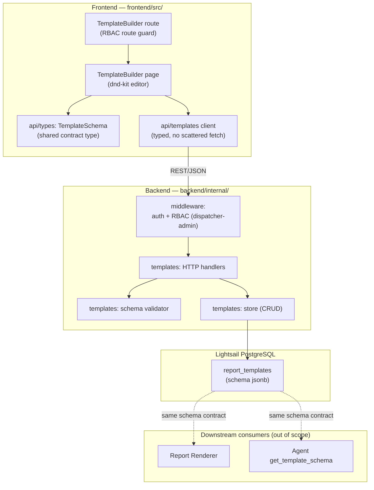
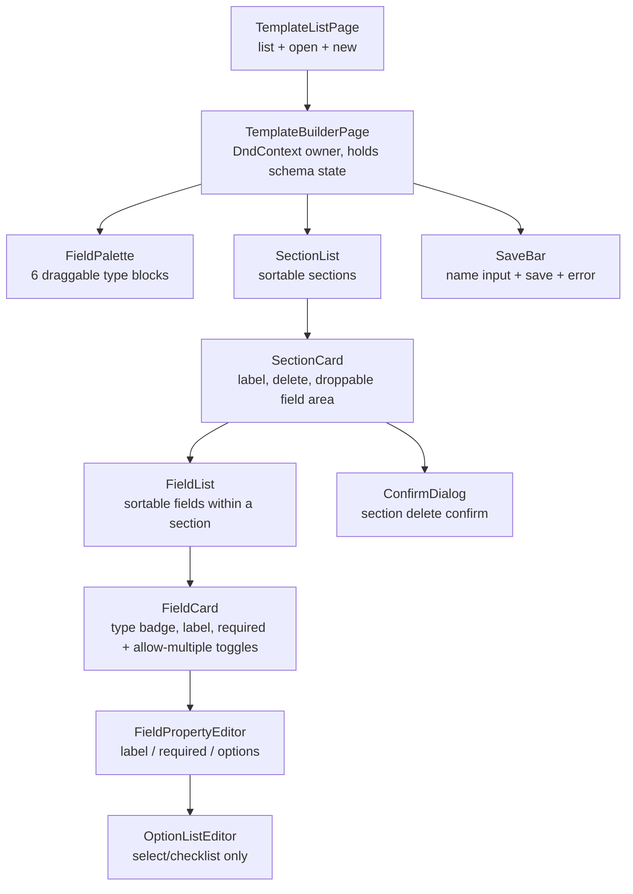

# Design Document: Template Builder

## Overview

The Template Builder lets a dispatcher-admin compose report templates from typed field blocks using a drag-and-drop editor, then save, reopen, and list them. Its central output is the **Template Schema** — an ordered list of sections, each holding an ordered list of typed fields — persisted as JSON in `report_templates.schema` (jsonb). That schema is the single shared contract consumed by three parties: this builder, the Report Renderer (owned by Aaron, out of scope here), and the AI agent's `get_template_schema` tool.

Because the schema is a shared contract, the design treats its shape as the most important artifact: it is defined once, mirrored in a shared TypeScript type on the frontend and a matching Go struct on the backend, and validated on every write. The builder UI is built on **dnd-kit** rather than a custom canvas, keeping the feature in scope. Every backend call flows through the typed API client in `frontend/src/api/`; write routes are gated to dispatcher-admins by RBAC middleware.

This design covers three surfaces:

- **The Template Schema contract** — the JSON shape, the shared TypeScript type (with the six-type `Field_Type` union), and the matching Go representation.
- **Frontend** (`frontend/src/pages/TemplateBuilder/`) — component structure, dnd-kit wiring, field/section editing, save/edit/list flows, mobile-first high-contrast UI.
- **Backend** (`backend/internal/templates/`) — `report_templates` CRUD, schema validation, RBAC enforcement, the migration, and 2–3 seed templates.

### Field type note

The `Field_Type` union has **six** members: `text`, `number`, `select`, `checklist`, `photo`, and `signature`. `signature` is a distinct capture type (a signature pad) and is treated exactly like the other non-option types — it carries a stable id, a label, and a `required` flag, but no options list. Only `select` and `checklist` carry an `options` list. This mirrors real-world field-service report templates (SafetyCulture, ServiceTitan, GoAudits, Appenate), which uniformly include a distinct signature/sign-off capture.

Every Field also carries an optional **`allowMultiple`** boolean flag (default false). It authors, at the template level, whether the field may hold more than one value at fill time — e.g. a photo field that accepts several photos. The Template Builder only sets the flag; honoring it (rendering repeated inputs) is the Report Renderer's fill-time responsibility. It applies to any field type and does not interact with the options list.

### Out of scope (owned by the Report Renderer spec — Aaron)

- **Photo captions.** Photo fields get an optional caption at render/fill time. This is a rendered-value concern, **not** a schema change — no `caption` appears in the Template Schema.
- **Parts used.** Parts-used is backed by a dedicated `parts_used` table, not a template field type. The builder offers no "parts" field type.

These are referenced only as downstream consumers of the schema; nothing in this design implements them.

## Architecture



### Request flow (write path)

1. The dispatcher-admin edits in the builder; the editor holds the working Template Schema in React state.
2. On save, the builder calls the typed API client (`createTemplate` / `updateTemplate`), which issues a REST/JSON request.
3. The request passes auth middleware, then RBAC middleware, which rejects non-dispatcher-admins with an authorization error before the handler runs.
4. The handler decodes the body, runs the schema validator, and — only if valid — persists to `report_templates`. A validation failure returns a structured error identifying the offending element and persists nothing.

### Design decisions

- **Schema defined once, mirrored, not duplicated in logic.** The TypeScript type in `frontend/src/api/` and the Go struct in `backend/internal/templates/` are two views of one contract. Validation rules live only on the backend (authoritative); the frontend does lightweight inline validation for UX but never becomes the source of truth.
- **dnd-kit over a custom editor.** Per tech steering, we use dnd-kit's sortable + droppable primitives. This gives palette-to-section drops, in-section reorder, and cross-section moves without building undo/redo or a canvas.
- **IDs generated client-side, validated server-side.** New field ids are assigned in the builder (stable across edits) and re-checked for uniqueness on save, so the contract holds regardless of client behavior.
- **Validation is total.** Every input either validates cleanly or returns an error naming the offending element — there is no partial persist.

## Components and Interfaces

### Frontend components (`frontend/src/pages/TemplateBuilder/`)



**Component responsibilities**

- **TemplateListPage** — retrieves templates through the API client and displays seed + custom templates (Req 5.4, 7.3); entry points to open an existing template or start a new one.
- **TemplateBuilderPage** — owns the dnd-kit `DndContext` and the single working `TemplateSchema` in state. All schema mutations (add/reorder/move/remove/edit) are reducer actions on this state. Owns the template name and dirty-tracking.
- **FieldPalette** — renders exactly one draggable block per `Field_Type` (Req 2.1). Each palette item is a dnd-kit draggable carrying its `type`.
- **SectionList / SectionCard** — sections are a dnd-kit `SortableContext` (vertical). Each `SectionCard` is both sortable (reorder, Req 3.4) and a droppable target for fields. `SectionCard` holds the section label editor and delete control (with confirm when non-empty, Req 3.8–3.9).
- **FieldList / FieldCard** — fields within a section are a nested `SortableContext`. A `FieldCard` is sortable (in-section reorder Req 3.5, cross-section move Req 3.6) and shows the type, label, and the required + allow-multiple toggles.
- **FieldPropertyEditor / OptionListEditor** — edit label (Req 4.1–4.2), required flag (Req 4.3), allow-multiple flag (Req 4.4), and — for `select`/`checklist` only — the options list (Req 4.5–4.8). `OptionListEditor` is not rendered for `text`, `number`, `photo`, or `signature`.
- **SaveBar** — template name field and save action; surfaces save errors while retaining edits (Req 5.5–5.6).
- **ConfirmDialog** — large-tap-target confirmation for destructive section delete.

### Schema mutation reducer (frontend)

All edits go through a pure reducer over `TemplateSchema`, which keeps mutations testable and keeps the dnd handlers thin:

```typescript
type BuilderAction =
  | { kind: "addSection"; label: string }
  | { kind: "renameSection"; sectionId: string; label: string }
  | { kind: "reorderSections"; fromIndex: number; toIndex: number }
  | { kind: "removeSection"; sectionId: string }
  | { kind: "addField"; sectionId: string; type: FieldType; atIndex: number }
  | { kind: "moveField"; fieldId: string; toSectionId: string; toIndex: number }
  | { kind: "reorderField"; sectionId: string; fromIndex: number; toIndex: number }
  | { kind: "removeField"; fieldId: string }
  | { kind: "renameField"; fieldId: string; label: string }
  | { kind: "setRequired"; fieldId: string; required: boolean }
  | { kind: "setAllowMultiple"; fieldId: string; allowMultiple: boolean }
  | { kind: "addOption"; fieldId: string; value: string }
  | { kind: "editOption"; fieldId: string; index: number; value: string }
  | { kind: "removeOption"; fieldId: string; index: number };

function builderReducer(state: TemplateSchema, action: BuilderAction): TemplateSchema;
```

The reducer is pure (returns a new schema, never mutates), which is what makes the reorder/move invariants (see Correctness Properties) directly testable.

### dnd-kit wiring

A single `DndContext` in `TemplateBuilderPage` coordinates three drag scenarios. Sensors are configured with an activation constraint (small drag distance) so taps on controls aren't hijacked — important for the mobile tap targets.

- **Palette → section (add).** Palette items are draggables whose drag data is `{ source: "palette", type }`. Section field areas are droppables. On drop over a section's field area at index `i`, dispatch `addField` with `atIndex: i` (Req 2.2). New fields get a client-generated unique id (Req 2.3), `required: false` (Req 2.4), and a non-empty default label derived from the type, e.g. "Untitled text field" (Req 2.5). A release outside any section droppable dispatches nothing (Req 2.6).
- **Field reorder within a section.** Fields use `SortableContext` with `verticalListSortingStrategy`. `onDragEnd` where source and target section match dispatches `reorderField` (Req 3.5).
- **Cross-section move.** When a field's `onDragEnd` target section differs from its source, dispatch `moveField` (Req 3.6); dropping onto an empty section places the field as its only field.
- **Section reorder.** Sections are their own `SortableContext`; reordering dispatches `reorderSections` (Req 3.4).

Drag data carries a discriminant (`"palette"` vs `"field"` vs `"section"`) so `onDragEnd` can branch without ambiguity. The `collisionDetection` strategy is `closestCenter` for lists and pointer-within for section drop zones.

### API client (`frontend/src/api/`)

The typed client is the only path to the backend (Req 5.7). It exposes:

```typescript
// frontend/src/api/templates.ts
export interface TemplateSummary {
  id: string;
  name: string;
  isSeed: boolean;
  updatedAt: string;
}

export interface TemplateRecord {
  id: string;
  name: string;
  schema: TemplateSchema;
  isSeed: boolean;
  createdAt: string;
  updatedAt: string;
}

export interface ValidationError {
  code: "validation_error";
  message: string;
  elementId: string | null; // offending field/section id when applicable
}

export function listTemplates(): Promise<TemplateSummary[]>;      // Req 5.4, 7.3
export function getTemplate(id: string): Promise<TemplateRecord>; // Req 5.2
export function createTemplate(input: { name: string; schema: TemplateSchema }): Promise<TemplateRecord>; // Req 5.1
export function updateTemplate(id: string, input: { name: string; schema: TemplateSchema }): Promise<TemplateRecord>; // Req 5.3
```

Errors from validation (HTTP 422) and authorization (HTTP 403) are surfaced as typed rejections the builder maps to messages.

### Backend interfaces (`backend/internal/templates/`)

```go
package templates

// Store owns report_templates persistence.
type Store interface {
    List(ctx context.Context) ([]TemplateSummary, error)
    Get(ctx context.Context, id string) (TemplateRecord, error)
    Create(ctx context.Context, name string, schema TemplateSchema) (TemplateRecord, error)
    Update(ctx context.Context, id, name string, schema TemplateSchema) (TemplateRecord, error)
}

// Validate checks a schema against every Requirement 1 rule.
// It returns nil on success, or a *ValidationError naming the offending element.
func Validate(schema TemplateSchema) error

// ValidationError identifies the offending element by id (or "" for structural errors).
type ValidationError struct {
    Field   string // "type" | "label" | "options" | "identifier" | "structure"
    Element string // offending field/section identifier, empty if structural
    Message string
}
func (e *ValidationError) Error() string
```

**HTTP routes** (mounted under the RBAC-protected group for writes):

| Method | Path                     | Auth        | Purpose            | Requirements |
|--------|--------------------------|-------------|--------------------|--------------|
| GET    | `/api/templates`         | any authed  | list templates     | 5.4, 7.3     |
| GET    | `/api/templates/{id}`    | any authed  | load one template  | 5.2          |
| POST   | `/api/templates`         | dispatcher-admin | create        | 5.1, 6.1, 6.3 |
| PUT    | `/api/templates/{id}`    | dispatcher-admin | update        | 5.3, 6.1, 6.3 |

Handlers decode the body into the Go `TemplateSchema`, call `Validate`, and on success call the `Store`. On validation failure they return `422` with the `ValidationError` body; the store is never touched (Req 1.8, 1.9, 1.11, 1.12, 1.13). Write routes sit behind RBAC middleware (below), so a non-dispatcher-admin never reaches the handler (Req 6.1, 6.3).

### RBAC middleware (`backend/internal/middleware/`)

A `RequireRole("dispatcher_admin")` middleware wraps the write routes. It reads the authenticated user's role from the request context (populated by auth middleware) and returns `403` with an authorization error when the role is absent (Req 6.1, 6.3). Read routes are not gated by role. The frontend additionally guards the builder route so technicians never see it (Req 6.2), but the backend check is authoritative.

## Data Models

### Template Schema — JSON shape (the shared contract)

Stored in `report_templates.schema` (jsonb). Concrete structure:

```json
{
  "version": 1,
  "sections": [
    {
      "id": "sec_visit_info",
      "label": "Visit Information",
      "fields": [
        {
          "id": "fld_arrival_notes",
          "type": "text",
          "label": "Arrival notes",
          "required": false
        },
        {
          "id": "fld_meter_reading",
          "type": "number",
          "label": "Meter reading",
          "required": true
        },
        {
          "id": "fld_system_type",
          "type": "select",
          "label": "System type",
          "required": true,
          "options": ["Split", "Packaged", "Ductless"]
        },
        {
          "id": "fld_safety_checks",
          "type": "checklist",
          "label": "Safety checks completed",
          "required": true,
          "options": ["Power isolated", "Refrigerant checked", "Area cleared"]
        },
        {
          "id": "fld_unit_photo",
          "type": "photo",
          "label": "Unit photo",
          "required": false,
          "allowMultiple": true
        },
        {
          "id": "fld_customer_signoff",
          "type": "signature",
          "label": "Customer sign-off",
          "required": true
        }
      ]
    }
  ]
}
```

Rules embedded in the shape (all from Req 1):

- `sections`: ordered, 1–50 entries (Req 1.1).
- each section: `id`, `label` (1–120 chars, non-empty), and `fields` ordered 0–100 (Req 1.1, 1.5).
- each field: `id` (unique within template, 1–64 chars, stable across edits, Req 1.4), `type` (one of the six, Req 1.2), `label` (1–120 chars, non-empty, Req 1.5), `required` (boolean, Req 1.3).
- `options` present **only** on `select`/`checklist`: 1–50 entries, each unique within the field (Req 1.6). Absent on `text`, `number`, `photo`, `signature`.
- `version` is a forward-compatibility marker for the contract; value `1` for this feature.

### Shared TypeScript type (`frontend/src/api/types.ts`)

This is the one definition the Template Builder and Report Renderer both reference (Req 1.10):

```typescript
// The Field_Type union — all six supported types.
export type FieldType =
  | "text"
  | "number"
  | "select"
  | "checklist"
  | "photo"
  | "signature";

// Types that carry an options list.
export type OptionFieldType = "select" | "checklist";

// A field without options: text, number, photo, signature.
export interface BasicField {
  id: string;
  type: Exclude<FieldType, OptionFieldType>;
  label: string;
  required: boolean;
  // When true, the field may hold more than one value at fill time (e.g.
  // multiple photos). Authored here; the Report Renderer honors it at fill
  // time. Optional; absent is treated as false.
  allowMultiple?: boolean;
}

// A field with an options list: select, checklist.
export interface OptionField {
  id: string;
  type: OptionFieldType;
  label: string;
  required: boolean;
  allowMultiple?: boolean; // see BasicField.allowMultiple
  options: string[]; // 1..50, unique within the field
}

export type Field = BasicField | OptionField;

export interface Section {
  id: string;
  label: string;
  fields: Field[]; // 0..100
}

export interface TemplateSchema {
  version: 1;
  sections: Section[]; // 1..50
}

// Narrowing helper the builder and renderer share.
export function hasOptions(field: Field): field is OptionField {
  return field.type === "select" || field.type === "checklist";
}
```

The discriminated union makes `options` reachable **only** when `type` is `select` or `checklist`, so `signature` (and `text`/`number`/`photo`) can never carry options at the type level — the contract is enforced by the compiler on the frontend and by `Validate` on the backend.

### Go representation (`backend/internal/templates/schema.go`)

Go lacks TypeScript's discriminated unions, so `options` is modeled as an optional slice and its presence/absence is enforced by `Validate`:

```go
type FieldType string

const (
    FieldText      FieldType = "text"
    FieldNumber    FieldType = "number"
    FieldSelect    FieldType = "select"
    FieldChecklist FieldType = "checklist"
    FieldPhoto     FieldType = "photo"
    FieldSignature FieldType = "signature"
)

func (t FieldType) known() bool {
    switch t {
    case FieldText, FieldNumber, FieldSelect, FieldChecklist, FieldPhoto, FieldSignature:
        return true
    }
    return false
}

func (t FieldType) carriesOptions() bool {
    return t == FieldSelect || t == FieldChecklist
}

type Field struct {
    ID       string    `json:"id"`
    Type          FieldType `json:"type"`
    Label         string    `json:"label"`
    Required      bool      `json:"required"`
    AllowMultiple bool      `json:"allowMultiple,omitempty"` // multi-value at fill time
    Options       []string  `json:"options,omitempty"`       // only for select/checklist
}

type Section struct {
    ID     string  `json:"id"`
    Label  string  `json:"label"`
    Fields []Field `json:"fields"`
}

type TemplateSchema struct {
    Version  int       `json:"version"`
    Sections []Section `json:"sections"`
}
```

### Validation rules (Go `Validate`, backend authoritative)

`Validate` walks the schema and returns the first `*ValidationError` it finds (naming the offending element), or `nil`:

| Rule | Check | Requirement |
|------|-------|-------------|
| Section count | 1 ≤ len(sections) ≤ 50 | 1.1, 1.11 |
| Field count | 0 ≤ len(fields) ≤ 100 per section | 1.1, 1.11 |
| Known type | `field.Type.known()` | 1.2, 1.7, 1.8 |
| Boolean required | always valid (Go type) — decode rejects non-bool | 1.3, 1.7 |
| Boolean allowMultiple | always valid (Go bool) — decode rejects non-bool | 1.14, 1.15 |
| Field id | non-empty, 1–64 chars | 1.4, 1.11 |
| Field id uniqueness | unique across all fields in template | 1.4, 1.7 |
| Section label | non-empty (trimmed), 1–120 chars | 1.5, 1.11, 1.12 |
| Field label | non-empty (trimmed), 1–120 chars | 1.5, 1.11, 1.12 |
| Options presence | `select`/`checklist` have 1–50 options | 1.6, 1.9, 1.11 |
| Options uniqueness | option values unique within field | 1.6, 1.13 |
| No stray options | non-option types have no options | 1.6 |

On any failure the handler returns `422` and persists nothing.

### Database — `report_templates` migration (`backend/db/migrations/`)

Additive and ordered per structure steering. The exact numeric prefix follows the last applied migration; shown here as `NNNN`:

```sql
-- NNNN_report_templates.sql
CREATE TABLE report_templates (
    id          UUID PRIMARY KEY DEFAULT gen_random_uuid(),
    name        TEXT NOT NULL CHECK (length(trim(name)) > 0),
    schema      JSONB NOT NULL,
    is_seed     BOOLEAN NOT NULL DEFAULT FALSE,
    created_at  TIMESTAMPTZ NOT NULL DEFAULT now(),
    updated_at  TIMESTAMPTZ NOT NULL DEFAULT now()
);

CREATE INDEX idx_report_templates_updated_at ON report_templates (updated_at DESC);
```

- `schema` is `jsonb` per the data model in tech steering.
- `is_seed` distinguishes seed templates so the list can display them alongside custom templates (Req 7.3) without a separate table.
- `name` non-empty at the DB level backstops the empty-name save block (Req 5.5).
- The migration is a new, ordered file — it does not edit any applied migration.

### Seed templates

Two to three seed templates are inserted at setup (a migration or seed script), each a valid `TemplateSchema` (Req 7.1, 7.2), exercising all six field types across the set:

1. **HVAC Service Visit** — sections: *Visit Information* (text, number), *Diagnostics* (select, checklist, photo), *Sign-off* (signature). Exercises every type.
2. **General Maintenance Report** — sections: *Job Summary* (text, text), *Parts & Observations* (checklist, photo), *Customer Approval* (signature). Note: parts capture here is a plain checklist/text in the template; the real `parts_used` table is a separate concern (out of scope).
3. **Safety Inspection** — sections: *Site* (select, text), *Checks* (checklist, checklist), *Attestation* (signature). Emphasizes checklist/signature sign-off.

Each is inserted with `is_seed = TRUE`. They are validated by the same `Validate` before insert so a broken seed fails setup loudly rather than shipping an invalid contract.

## Correctness Properties

*A property is a characteristic or behavior that should hold true across all valid executions of a system — essentially, a formal statement about what the system should do. Properties serve as the bridge between human-readable specifications and machine-verifiable correctness guarantees.*

These properties fall into three groups: the **backend validator** (a pure function over a schema), the **frontend builder reducer** (pure schema mutations), and the **persistence + RBAC** boundary. Each is implemented by a single property-based test running at least 100 iterations. Properties were consolidated to remove redundancy (e.g., label-rejection folds into label validity; the two persistence round-trips combine; the three option-rejection rules combine into one option-validity property).

### Property 1: Validator totality

*For any* schema, `Validate` returns `nil` if and only if the schema satisfies every Requirement 1 rule; and for any valid schema with exactly one rule violation injected (unknown type, empty/oversized label, duplicate id, out-of-bounds count, bad option list), `Validate` returns a `ValidationError`.

**Validates: Requirements 1.7, 1.3**

### Property 2: Bounds and identifier uniqueness are enforced, and the offending element is named

*For any* schema that differs from a valid schema by a single out-of-bounds value — 0 or >50 sections, >100 fields in a section, a field/section label whose trimmed length is 0 or >120, a field id whose length is 0 or >64, or a duplicate field id — `Validate` rejects it and the returned error identifies the offending element (its id, or a structural marker for the section-count case).

**Validates: Requirements 1.1, 1.4, 1.5, 1.11, 1.12**

### Property 3: Unknown field types are rejected and named

*For any* valid schema, replacing one field's `type` with any string outside the six-type union causes `Validate` to reject the schema and return an error naming that field's id.

**Validates: Requirements 1.2, 1.8**

### Property 4: Option-list validity for select and checklist

*For any* schema, a `select` or `checklist` field validates if and only if it has between 1 and 50 options with values unique within that field, and a non-option field (`text`, `number`, `photo`, `signature`) validates only if it carries no options; any violation (empty/missing list, more than 50, duplicate values, or stray options on a non-option type) causes rejection with an error naming the offending field's id.

**Validates: Requirements 1.6, 1.9, 1.13**

### Property 5: Field identifiers are stable across edits

*For any* schema and any sequence of non-add reducer actions (rename field/section, toggle required, reorder fields/sections, move field, add/edit/remove option), every field that existed before the sequence retains the exact same id afterward.

**Validates: Requirements 1.4**

### Property 6: Adding a field inserts a typed field at the drop position

*For any* schema, target section, `Field_Type`, and drop index within that section's field list, applying `addField` yields a schema whose target section has exactly one more field, with the new field at the drop index and carrying the chosen type.

**Validates: Requirements 2.2**

### Property 7: Added fields have identifiers unique within the template

*For any* schema and any sequence of `addField` actions, all field identifiers across the whole template remain pairwise distinct.

**Validates: Requirements 2.3**

### Property 8: Added fields carry safe defaults

*For any* schema, target section, and `Field_Type`, applying `addField` produces a new field whose `required` flag is `false` and whose label is a non-empty string.

**Validates: Requirements 2.4, 2.5**

### Property 9: Adding a section appends it last

*For any* schema and any valid section label, applying `addSection` yields a schema with one more section whose last entry is the new section, leaving all prior sections unchanged and in order.

**Validates: Requirements 3.1**

### Property 10: Reordering sections is a permutation

*For any* schema and any valid source/target index pair, applying `reorderSections` yields a schema whose sections are a permutation of the originals (same multiset of sections, none added or dropped) with the moved section at the target position.

**Validates: Requirements 3.4**

### Property 11: Reordering fields within a section is a local permutation

*For any* schema, target section, and valid source/target index pair, applying `reorderField` yields a schema where that section's fields are a permutation of their originals and every other section is byte-for-byte unchanged.

**Validates: Requirements 3.5**

### Property 12: Moving a field preserves the total field multiset

*For any* schema with at least two sections, any field, and any target section and index, applying `moveField` removes the field from its source section and inserts it into the target section at the target index (as the sole field when the target was empty), while the multiset of all fields across the template is unchanged.

**Validates: Requirements 3.6**

### Property 13: Removing a field deletes exactly that field

*For any* schema and any existing field id, applying `removeField` yields a schema that no longer contains that id, contains one fewer field in total, and leaves every other field unchanged.

**Validates: Requirements 3.7**

### Property 14: Removing a section deletes that section and only its fields

*For any* schema and any existing section id, applying `removeSection` yields a schema without that section and without any of the fields it contained, while every remaining section and its fields are unchanged.

**Validates: Requirements 3.9**

### Property 15: Label and required edits change only the target element

*For any* schema and any existing field or section, applying `renameField` / `renameSection` with a non-empty label (or `setRequired` / `setAllowMultiple` with a boolean) updates only that element's label (or the targeted flag) and leaves every other element unchanged.

**Validates: Requirements 4.1, 4.3, 4.4, 4.9**

### Property 16: Option edits mutate only the target field's option list

*For any* schema and any existing `select`/`checklist` field: `addOption` appends the value to that field's option list (length +1); `editOption` at a valid index replaces only that entry; and `removeOption` at a valid index on a list of length greater than one removes only that entry (length −1). In all three cases no other field or section changes.

**Validates: Requirements 4.4, 4.5, 4.6**

### Property 17: Persistence round-trip preserves the schema

*For any* valid schema, creating a template and then loading it (create → get) returns a schema deep-equal to the one saved; and updating an existing template with another valid schema and reloading (update → get) returns a schema deep-equal to the update.

**Validates: Requirements 5.2, 5.3**

### Property 18: Write access is restricted to dispatcher-admins

*For any* authenticated role, a `report_templates` write request succeeds only when the role is dispatcher-admin; every other role receives an authorization error and no record is created or modified.

**Validates: Requirements 6.1**

### Property 19: Seed templates conform to the schema contract

*For any* seed template shipped at setup, `Validate` returns `nil`.

**Validates: Requirements 7.2**

## Error Handling

### Backend

- **Validation failures (422).** `Validate` returns a `*ValidationError` naming the offending element (`Field` category + `Element` id + human message). The handler maps this to HTTP `422` with the JSON body `{ "code": "validation_error", "message": ..., "elementId": ... }` and does **not** touch the store — no partial persistence (Req 1.8, 1.9, 1.11, 1.12, 1.13).
- **Authorization failures (403).** RBAC middleware short-circuits non-dispatcher-admin writes with `403` before the handler runs; the store is never reached (Req 6.1, 6.3).
- **Malformed JSON / wrong types (400).** A body that fails to decode into `TemplateSchema` (e.g., non-boolean `required`, non-array `sections`) returns `400` with a decode error; validation is not attempted.
- **Not found (404).** `Get`/`Update` on an unknown id returns `404`.
- **Store/DB errors (500).** Unexpected persistence failures return `500` with a generic message; details are logged server-side, never leaked to the client.

### Frontend

- **Inline edit validation.** Empty/whitespace labels (field and section) and empty template names are caught in the editor: the change is rejected, the previous value is retained in the working schema, and a "label is required" / "name is required" message is shown (Req 3.3, 4.2, 4.9, 5.5). Removing the last option of a `select`/`checklist` is blocked with an "at least one option is required" message (Req 4.7).
- **Save failures.** If the API client rejects (validation 422, auth 403, network, or 500), the builder keeps all unsaved edits in the editor and surfaces the error message — for a 422 it highlights the offending element using `elementId` (Req 5.6).
- **Drop-outside.** An `onDragEnd` with no valid section target dispatches no action, leaving the schema unchanged (Req 2.6).
- **Route guard.** A non-dispatcher-admin navigating to the builder route is redirected/blocked by the frontend guard (Req 6.2); the backend RBAC check remains authoritative.

All frontend error paths preserve editor state — the dispatcher never loses work to a failed request or a rejected edit.

## Testing Strategy

A dual approach: property-based tests for universal correctness, example/edge/integration tests for the rest.

### Property-based tests

Property-based testing applies here because the validator and the builder reducer are pure functions with clear input/output behavior and large input spaces, and the persistence layer has a natural round-trip.

- **Backend (Go):** use `testing/quick` or `pgregory.net/rapid` (rapid preferred for richer generators/shrinking) — do not hand-roll PBT. Generators produce valid schemas plus targeted single-violation mutations. Properties 1–4, 18, 19 live here.
- **Frontend (TypeScript):** use `fast-check` with Vitest — do not hand-roll PBT. Generators produce arbitrary valid `TemplateSchema` values and valid action parameters. Properties 5–16 (reducer) live here.
- **Persistence (Go, Property 17):** round-trip against a test database (or a store test double honoring the same contract); generate valid schemas, create/update, reload, assert deep equality.
- Each property test runs a **minimum of 100 iterations**.
- Each property test is tagged with a comment referencing its design property, in the format:
  `Feature: template-builder, Property {number}: {property_text}`
  For example: `// Feature: template-builder, Property 12: Moving a field preserves the total field multiset`.
- Each of the 19 correctness properties is implemented by a **single** property-based test.

A shared generator for valid `TemplateSchema` (both languages) produces: 1–50 sections; 0–100 fields; the six field types with `options` present only on `select`/`checklist` (1–50 unique values); ids within 1–64 chars and unique; labels within 1–120 chars, non-empty. Edge inputs (empty strings, whitespace-only labels, boundary counts, unicode option values, oversized ids) are drawn deliberately so boundaries are exercised rather than left to chance.

### Unit and example tests

Focused examples and edge cases not suited to universal properties:

- **Palette renders six blocks**, one per `Field_Type` (Req 2.1).
- **Shared type check** — a compile-time assertion that `FieldType` is exactly the six literals and a sample schema type-checks against `TemplateSchema` (Req 1.10).
- **Non-boolean `required` decode** rejected (Req 1.3 at the wire level).
- **Add-section label flow** — 1–100 char request, whitespace-only rejected with message (Req 3.2, 3.3).
- **Drop-outside** dispatches no action (Req 2.6).
- **Section-delete confirmation** — non-empty section requires confirm; delete only after confirm (Req 3.8).
- **Last-option removal blocked** with message (Req 4.7).
- **Whitespace label edits** (field/section) rejected, previous retained, message shown (Req 4.2, 4.9).
- **Empty template name** blocks save with message (Req 5.5).
- **Save failure** retains edits and shows error (Req 5.6).
- **Frontend route guard** blocks non-dispatcher-admins, allows dispatcher-admins (Req 6.2).

### Integration tests

- **Create / list / open / update flows** through the real API client against a test backend (Req 5.1, 5.2, 5.3, 5.4).
- **Seed display** — with seeds plus a custom template, the list returns both (Req 7.3).
- **RBAC on live routes** — a dispatcher-admin write succeeds; a technician write returns 403 (end-to-end confirmation of Property 18).

### Smoke / structural checks

- **dnd-kit present** — the builder mounts a `DndContext` and uses dnd-kit primitives (Req 2.7).
- **No scattered fetch** — a lint/grep check confirms `TemplateBuilder` makes no direct `fetch` calls, only API-client calls (Req 5.7).
- **RBAC wraps every write route** — router-table inspection confirms each write route is behind the dispatcher-admin middleware (Req 6.3).
- **Seed count** — after setup, 2–3 rows with `is_seed = true` exist (Req 7.1).

### Mobile-first / accessibility checks

- **Tap targets** — computed size of interactive controls is at least 44×44 CSS px (Req 8.2).
- **Contrast** — theme color pairs meet a 4.5:1 ratio (Req 8.3).
- **Choice controls** — options render as large tap-target components, not native `select` (Req 8.4).
- **Responsive layout** — the builder renders and adapts at mobile viewport widths (Req 8.1). Full WCAG conformance requires manual testing with assistive technologies and expert review beyond these automated checks.
